# Le codage couleur de la télévision analogique

### NTSC, PAL, SECAM — la théorie, les mathématiques, et ce que tout cela fait à vos pixels

---

Ce document est un cours. Il part d'un problème d'ingénierie posé en 1953, en
suit les conséquences jusqu'aux artefacts que l'on voyait encore sur les
téléviseurs des années 1990, et démontre chaque étape plutôt que de l'énoncer.

Toutes les figures qu'il contient sont des sorties réelles du simulateur qui
l'accompagne : aucune n'a été dessinée à la main. Toutes les valeurs numériques
citées ont été mesurées sur ce même simulateur, et les propriétés
fondamentales sont vérifiées par une suite de tests (`tests/`). Quand le texte
affirme quelque chose de vérifiable, il indique la fonction qui le calcule et
le test qui le contrôle.

**Table des matières**

1. [Le problème de 1953](#1-le-problème-de-1953)
2. [Colorimétrie et gamma](#2-colorimétrie-et-gamma)
3. [D'où viennent 0,299 / 0,587 / 0,114](#3-doù-viennent-0299--0587--0114)
4. [Les signaux de différence de couleur](#4-les-signaux-de-différence-de-couleur)
5. [L'entrelacement spectral](#5-lentrelacement-spectral)
6. [NTSC](#6-ntsc)
7. [Le péché du NTSC : l'erreur de phase](#7-le-péché-du-ntsc--lerreur-de-phase)
8. [PAL](#8-pal)
9. [SECAM](#9-secam)
10. [Décoder : réjecteur, peigne, et les artefacts qui en naissent](#10-décoder--réjecteur-peigne-et-les-artefacts-qui-en-naissent)
11. [Ce que tout cela fait au RGB d'origine](#11-ce-que-tout-cela-fait-au-rgb-dorigine)
12. [Les shaders : la même chaîne, en temps réel](#12-les-shaders--la-même-chaîne-en-temps-réel)
13. [Le son : l'autre porteuse](#13-le-son--lautre-porteuse)
14. [La cassette : ce qu'un magnétoscope fait au signal](#14-la-cassette--ce-quun-magnétoscope-fait-au-signal)
15. [La caméra : la queue de comète](#15-la-caméra--la-queue-de-comète)
16. [Annexes](#16-annexes)

---

## 1. Le problème de 1953

### 1.1 Un canal déjà plein

En 1941, les États-Unis normalisent la télévision en noir et blanc : 525 lignes,
60 trames par seconde, un canal hertzien de 6 MHz dont 4,2 MHz sont occupés par
l'image et le reste par la porteuse son, placée 4,5 MHz au-dessus de la porteuse
image. Dix ans plus tard, plus de dix millions de récepteurs sont en service.

Le problème posé au *National Television System Committee* n'est donc pas
« comment transmettre de la couleur », mais quelque chose de bien plus contraint :

> Comment ajouter la couleur à un signal existant, sans un hertz de bande
> supplémentaire, sans rendre obsolètes dix millions de récepteurs, et de
> telle sorte qu'un récepteur couleur affiche correctement une émission en
> noir et blanc ?

La première tentative avait échoué sur ce point précis. Le système de CBS,
adopté puis abandonné en 1951, était *séquentiel à trames* : un disque coloré
tournant devant le tube présentait successivement les images rouge, verte et
bleue. C'était simple, la colorimétrie en était excellente — et c'était
totalement incompatible. Un récepteur noir et blanc n'y voyait qu'un
scintillement.

### 1.2 Les deux faits qui rendent la chose possible

Toute la télévision couleur analogique repose sur deux propriétés de la vision
humaine, et sur rien d'autre.

**Premièrement, l'œil sépare la luminance des couleurs.** Notre système visuel
possède un canal achromatique à haute résolution et deux canaux chromatiques
à basse résolution. On distingue des détails de luminance dix fois plus fins
que des détails de couleur.

**Deuxièmement, une image se décompose en une composante achromatique et deux
composantes chromatiques** sans perte : ce n'est qu'un changement de base dans
l'espace des couleurs, donc réversible.

De là découle la stratégie : on transmet la luminance exactement comme avant —
c'est elle que verra le récepteur noir et blanc — et on glisse les deux
composantes chromatiques, sévèrement réduites en bande passante, dans les
interstices du signal existant.

Le mot « interstices » n'est pas une métaphore. Le chapitre 5 montrera que le
spectre d'une image balayée est un peigne de raies séparées par du vide, et
que ce vide est très exactement là où l'on peut loger un second signal.

### 1.3 Trois réponses au même problème

Trois systèmes ont résolu cette équation, dans cet ordre :

| | NTSC | PAL | SECAM |
|---|---|---|---|
| Normalisé | 1953, États-Unis | 1963, Allemagne (Walter Bruch, Telefunken) | 1956–1967, France (Henri de France) |
| Chrominance portée par | amplitude **et** phase d'une sous-porteuse | idem, mais une composante alterne de signe | **fréquence** de deux sous-porteuses |
| Les deux composantes sont | simultanées | simultanées | **séquentielles**, une par ligne |
| Talon d'Achille | l'erreur de phase | la résolution verticale de la couleur | tout ce qui touche à l'amplitude est perdu |

Ils partagent le même matriçage, les mêmes coefficients de luminance et la
même philosophie. Ils divergent uniquement sur la façon de moduler la
sous-porteuse — et cette seule différence entraîne tout le reste.

---

## 2. Colorimétrie et gamma

### 2.1 Les primaires : le même nombre ne désigne pas la même couleur

Un triplet $(R, G, B)$ n'est pas une couleur. C'est une recette : *tant* de la
primaire rouge de cet écran-là, *tant* de sa primaire verte, *tant* de sa
primaire bleue. Changez d'écran, la recette produit une autre couleur.

Pour parler de couleurs sans ambiguïté, la CIE a défini en 1931 un espace
absolu, XYZ, et sa projection $(x, y)$ dite *diagramme de chromaticité*. Un jeu
de primaires est alors trois points dans ce plan, plus un blanc de référence.
Le triangle qu'ils forment est le **gamut** : l'ensemble des couleurs
reproductibles.

Passer de RGB linéaire à XYZ est une matrice $3\times3$, entièrement
déterminée par les primaires et le blanc. On écrit les primaires normalisées
par leur $y$ :

$$
M = \begin{pmatrix}
x_R/y_R & x_G/y_G & x_B/y_B \\
1 & 1 & 1 \\
z_R/y_R & z_G/y_G & z_B/y_B
\end{pmatrix},
\qquad z = 1 - x - y
$$

puis on cherche les trois facteurs d'échelle $(s_R, s_G, s_B)$ qui envoient
$(1,1,1)$ sur le blanc de référence $W$ :

$$
\mathbf{s} = M^{-1} W, \qquad
M_{\text{RGB}\to\text{XYZ}} = M \cdot \operatorname{diag}(\mathbf{s})
$$

> **Dans le code** — `colorimetrie.Primaires.matrice_vers_xyz`.

### 2.2 Trois jeux de primaires, et un mensonge normatif

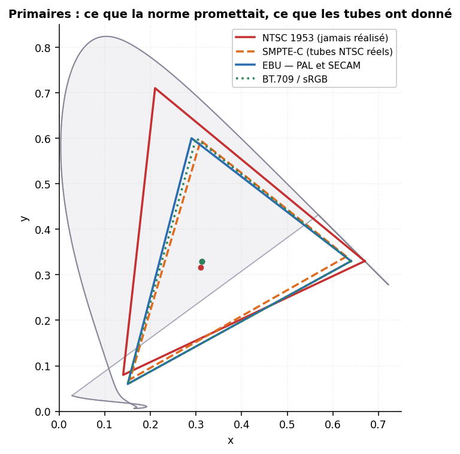

Le NTSC de 1953 spécifiait des primaires extrêmement saturées, sous illuminant
C. Elles supposaient des luminophores qui n'existaient pas. Ceux qu'on savait
fabriquer et qui étaient assez lumineux pour un salon éclairé avaient un gamut
bien plus étroit. Dès le milieu des années 1960, **aucun téléviseur américain
n'utilisait les primaires NTSC**, et l'écart a fini par être normalisé sous le
nom SMPTE-C.

L'Europe, arrivant plus tard, a normalisé d'emblée les primaires réellement
disponibles (EBU Tech. 3213), qui sont à un cheveu de celles du sRGB
d'aujourd'hui.

Conséquence pratique, visible sur la figure ci-dessous : une image sRGB
réinterprétée dans les primaires de 1953 paraît **terne**. Le gamut cible étant
plus large, le même triplet numérique y désigne une couleur moins éloignée du
blanc.

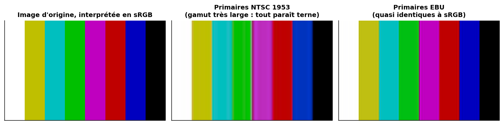

> **Dans le code** — `colorimetrie.PRIMAIRES`, `colorimetrie.convertir_primaires`.
> L'adaptation chromatique de Bradford est appliquée entre blancs différents,
> sans quoi le passage de l'illuminant C au D65 introduirait une dominante.

### 2.3 Le gamma : une économie devenue une contrainte

Un tube cathodique n'est pas linéaire. La luminance émise suit une loi de
puissance de la tension de commande :

$$L \propto V^{\gamma}, \qquad \gamma \approx 2{,}2 \ \text{à}\ 2{,}8$$

Il faut donc compenser. On aurait pu placer le correcteur dans chaque
récepteur ; on l'a placé une fois pour toutes à la prise de vue :

$$V' = L^{1/\gamma}$$

C'était un choix économique — un correcteur dans les studios plutôt que dans
dix millions de foyers — et il s'est révélé heureux à un autre titre : la
courbe $L^{1/\gamma}$ ressemble à la réponse de l'œil, si bien que quantifier
$V'$ uniformément répartit le bruit de façon perceptuellement homogène. C'est
la raison pour laquelle toute la vidéo numérique code encore aujourd'hui des
valeurs gamma-corrigées.

Mais ce choix a une conséquence qui va nous poursuivre pendant tout ce cours :

> **Le matriçage a lieu APRÈS la correction de gamma.**

Le codeur ne combine pas des luminances, il combine des racines γ-ièmes de
luminances. On note ces grandeurs avec une apostrophe — $R'$, $G'$, $B'$, $Y'$ —
et $Y'$ s'appelle **luma**, jamais *luminance*. Le chapitre 11 chiffrera ce que
cette apostrophe coûte.

BT.470 retient $\gamma = 2{,}2$ pour le système M et $\gamma = 2{,}8$ pour les
systèmes 625 lignes. Cette dernière valeur est une surestimation reconnue : les
tubes réels tournaient plutôt autour de 2,4.

> **Dans le code** — `colorimetrie.oetf_camera`, `colorimetrie.eotf_ecran`.

---

## 3. D'où viennent 0,299 / 0,587 / 0,114

Ces trois nombres sont les plus célèbres de la vidéo. Ils ne sont pas
arbitraires, et ils ne sont pas non plus le fruit d'un réglage empirique.

La composante $Y$ de l'espace CIE XYZ **est** la luminance photométrique, par
construction : la fonction $\bar y(\lambda)$ est la courbe d'efficacité
lumineuse de l'œil. Donc la deuxième ligne de la matrice
$M_{\text{RGB}\to\text{XYZ}}$ donne directement la contribution de chaque
primaire à la luminance.

Pour les primaires NTSC 1953 sous illuminant C, le calcul donne :

$$
Y = 0{,}29890\,R + 0{,}58662\,G + 0{,}11448\,B
$$

Les normalisateurs ont arrondi à trois décimales. **0,299 / 0,587 / 0,114.**

> **Vérifié par** — `tests/test_matrices.py::test_origine_des_coefficients_luma`,
> qui recalcule ces coefficients depuis les coordonnées des primaires et
> compare aux constantes de la norme.

### 3.1 Une incohérence assumée

Ces coefficients décrivent les primaires de 1953. Or PAL et SECAM utilisent les
primaires EBU, pour lesquelles le calcul donnerait :

$$
Y_{\text{EBU}} = 0{,}222\,R + 0{,}707\,G + 0{,}071\,B
$$

BT.470 a néanmoins conservé 0,299 / 0,587 / 0,114 pour les trois systèmes. La
« luma » transmise n'est donc pas la luminance des primaires effectivement
affichées. L'écart est réel, il n'a jamais été corrigé, et il s'ajoute
simplement à la non-constant-luminance du chapitre 11.

Il a fallu attendre la haute définition et BT.709 pour que les coefficients
soient recalculés sur les bonnes primaires — 0,2126 / 0,7152 / 0,0722. La
définition standard numérique (BT.601), elle, a gardé les valeurs de 1953 par
compatibilité.

> **Vérifié par** — `tests/test_matrices.py::test_les_coefficients_luma_ne_conviennent_plus_aux_primaires_modernes`.

---

## 4. Les signaux de différence de couleur

### 4.1 Pourquoi B−Y et R−Y

On veut transmettre $Y'$ plus deux autres signaux qui, avec elle, permettent de
retrouver $R'G'B'$. Le choix des différences de couleur $B'-Y'$ et $R'-Y'$
n'est pas le seul possible, mais il est le seul à satisfaire une contrainte
absolue :

> **Sur un gris, les deux signaux doivent être rigoureusement nuls.**

C'est la condition de compatibilité. Si la chrominance ne s'annule pas sur une
image en noir et blanc, le récepteur couleur y ajoutera des couleurs, et le
récepteur noir et blanc y verra un moirage. Comme $Y' = R' = G' = B'$ sur un
gris, toute différence $X' - Y'$ s'annule d'elle-même.

> **Vérifié par** — `tests/test_pipeline.py::test_ntsc_et_pal_n_emettent_rien_sur_une_image_grise`,
> qui contrôle que le signal de chrominance émis est nul à $10^{-9}$ près.

### 4.2 Pourquoi seulement deux, et pourquoi pas G−Y

Il n'est pas nécessaire d'en transmettre trois. De la définition de $Y'$ :

$$k_R R' + k_G G' + k_B B' = Y'$$

on tire immédiatement, en retranchant $(k_R + k_G + k_B)Y' = Y'$ :

$$
k_R (R'-Y') + k_G (G'-Y') + k_B (B'-Y') = 0
$$

donc

$$
G' - Y' = -\frac{k_R}{k_G}(R'-Y') - \frac{k_B}{k_G}(B'-Y')
        = -0{,}509\,(R'-Y') - 0{,}194\,(B'-Y')
$$

La troisième différence est une combinaison des deux autres. Mieux : ses
coefficients étant petits, c'est celle qui a la **plus faible amplitude** des
trois. La transmettre à la place d'une des deux autres coûterait du rapport
signal/bruit pour rien. On transmet donc les deux plus grandes, et le récepteur
reconstitue le vert.

### 4.3 D'où viennent 0,492 et 0,877

Les différences de couleur ne sont pas transmises telles quelles, mais mises à
l'échelle :

$$U = 0{,}492\,(B'-Y'), \qquad V = 0{,}877\,(R'-Y')$$

Ces deux nombres se démontrent. Le signal composite d'une couleur uniforme vaut

$$S(t) = Y' + \underbrace{\sqrt{U^2+V^2}}_{A}\,\sin(\omega t + \varphi)$$

et oscille donc entre $Y' - A$ et $Y' + A$.

Le cahier des charges impose que $S$ reste dans une excursion totale de $5/3$ de
l'amplitude vidéo : au plus $+4/3$ — au-delà, l'émetteur sature — et au moins
$-1/3$, au-delà commencerait la zone réservée aux signaux de synchronisation.

Cherchons les facteurs $u$ et $v$ tels que ces bornes soient atteintes
exactement. Deux couleurs les saturent :

**Le bleu pur** $(0,0,1)$ : $Y' = k_B = 0{,}114$, $B'-Y' = 1-k_B$,
$R'-Y' = -k_B$. Il doit toucher la borne basse :

$$
\big(u\,(1-k_B)\big)^2 + \big(v\,k_B\big)^2 = \left(k_B + \tfrac13\right)^2
$$

**Le rouge pur** $(1,0,0)$ : $Y' = k_R = 0{,}299$, $R'-Y' = 1-k_R$,
$B'-Y' = -k_R$. Même chose :

$$
\big(u\,k_R\big)^2 + \big(v\,(1-k_R)\big)^2 = \left(k_R + \tfrac13\right)^2
$$

C'est un système linéaire en $u^2$ et $v^2$. Sa résolution donne

$$\boxed{u = 0{,}492111 \qquad v = 0{,}877283}$$

— les constantes de la norme, à la sixième décimale.

Et la construction est élégante : les couleurs **complémentaires** (jaune,
cyan) ont la même amplitude de chrominance que leur primaire mais une luma
complémentaire $1-Y'$. Elles atteignent donc la borne haute exactement quand
les primaires atteignent la borne basse. Une seule contrainte suffisait pour
les deux.

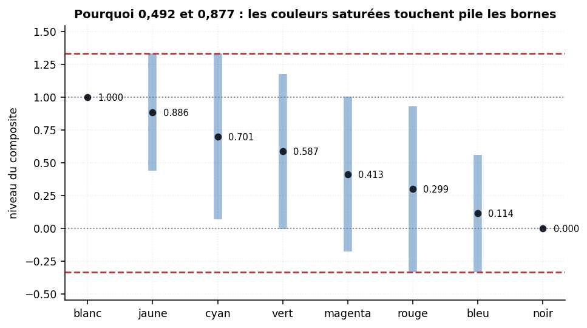

> **Dans le code** — `matrices.deriver_facteurs_echelle`, qui refait ce calcul.
> **Vérifié par** — `tests/test_matrices.py::test_deriver_facteurs_echelle` et
> `::test_excursion_composite_des_couleurs_saturees`.

### 4.4 Les trois bases, en résumé

| Système | Composantes | Définition |
|---|---|---|
| PAL | $U$, $V$ | $U = 0{,}492(B'-Y')$, $V = 0{,}877(R'-Y')$ |
| NTSC | $I$, $Q$ | $U$, $V$ tournés de 33° |
| SECAM | $D'_B$, $D'_R$ | $D'_B = +1{,}505(B'-Y')$, $D'_R = -1{,}902(R'-Y')$ |

Matrices complètes en [annexe A](#a-tableau-des-constantes).

---

## 5. L'entrelacement spectral

C'est le cœur mathématique de toute l'affaire, et la partie qu'on explique le
plus mal. Prenons-la lentement.

### 5.1 Une image balayée n'occupe pas tout le spectre

Un signal vidéo est une image lue ligne par ligne. Deux lignes consécutives se
ressemblent énormément — c'est même la définition d'une image. Deux images
consécutives, plus encore.

Le signal est donc **quasi périodique**, de période $T_H = 1/f_H$ (la durée
d'une ligne). Or le spectre d'un signal périodique n'est pas continu : c'est
un **peigne de raies** aux multiples entiers de sa fréquence fondamentale.

Formellement, si le contenu d'une ligne est $a(t)$ et que toutes les lignes
sont identiques, le signal $s(t) = \sum_n a(t - nT_H)$ a pour spectre

$$
S(f) = f_H \, A(f) \sum_{m \in \mathbb{Z}} \delta(f - m f_H)
$$

soit des raies aux fréquences $m f_H$, d'amplitudes données par le spectre
$A$ d'une ligne. **Entre ces raies, il n'y a rien.**

Dans une vraie image, les lignes diffèrent un peu, ce qui élargit chaque raie
d'une quantité de l'ordre de la fréquence trame — quelques dizaines de hertz
face à un espacement de 15 625 Hz. Les creux restent béants.

La figure ci-dessous montre ce peigne sur un signal réellement simulé. Le
panneau du bas, agrandi, est la démonstration :

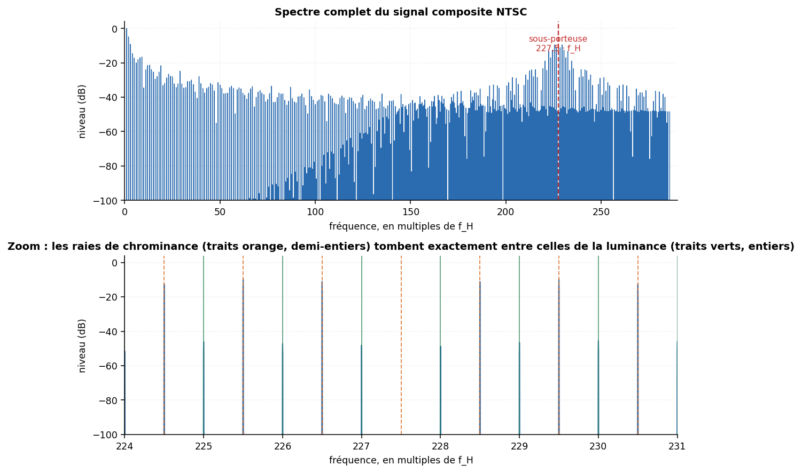

Dans la zone de luminance pure, les raies tombent sur les **entiers**. Autour
de la sous-porteuse, elles tombent sur les **demi-entiers** — exactement au
milieu des creux.

> **Vérifié par** — `tests/test_pipeline.py::test_entrelacement_spectral_des_peignes_luma_et_chroma`,
> qui détecte les pics du spectre simulé et contrôle leur partie fractionnaire.

### 5.2 Comment loger la chrominance dans les creux

Il suffit de moduler la chrominance sur une porteuse dont la fréquence est un
multiple **demi-entier** de $f_H$ :

$$f_{sc} = \left(m + \tfrac12\right) f_H$$

Le spectre de la chrominance est alors le peigne de la chrominance
(aux multiples de $f_H$) **translaté** de $f_{sc}$ : ses raies tombent en
$f_{sc} \pm k f_H$, c'est-à-dire sur des demi-entiers. Elles s'insèrent
exactement entre celles de la luminance.

Il y a mieux. Un décalage d'un demi-cycle par ligne signifie que **la
sous-porteuse s'inverse d'une ligne à la suivante**. Le motif de points qu'elle
produit sur l'écran est donc en damier plutôt qu'en bandes, et l'œil, qui
moyenne spatialement, le voit deux fois moins. Le même demi-cycle sur une image
complète (525 lignes, nombre impair) inverse aussi le motif d'une image à
l'autre : la persistance rétinienne l'atténue encore. C'est ce qui fait
« ramper » les points au lieu de les laisser fixes.

> **Dans le code** — `porteuse.phase`. La phase est calculée en **temps
> absolu**, jamais réinitialisée en début de ligne :
> $$\varphi(n, k) = 2\pi f_{sc}\left(n T_H + \frac{k}{f_e}\right)$$
> Toutes les propriétés ci-dessus en découlent arithmétiquement, sans qu'on ait
> rien à ajouter.
> **Vérifié par** — `tests/test_porteuse.py`, qui contrôle que l'écart de
> phase entre deux lignes vaut exactement $\pi$ à $10^{-9}$ près, y compris à
> la 480ᵉ ligne de la 100ᵉ image.

### 5.3 Pourquoi 455/2 en NTSC, et pourquoi 59,94 Hz

Le choix de $m$ résulte de trois contraintes qui se rencontrent.

**Assez haut** pour que le motif de points soit fin, donc peu visible.
**Assez bas** pour que les bandes latérales de la chrominance
($f_{sc} \pm 1{,}3$ MHz) tiennent dans les 4,2 MHz du canal.
**Et surtout** : il fallait éviter que la sous-porteuse couleur ne batte avec
la porteuse son, placée 4,5 MHz au-dessus de la porteuse image.

On a donc choisi de rendre l'écart entre les deux lui aussi demi-entier. En
posant

$$f_{son} = 286\, f_H$$

il vient $f_H = 4{,}5\ \text{MHz} / 286 = 15\,734{,}264$ Hz, et avec
$f_{sc} = \frac{455}{2} f_H = 3{,}579545$ MHz, le battement vaut

$$4{,}5 - 3{,}579545 = 0{,}920455\ \text{MHz} = \frac{117}{2} f_H$$

lui aussi demi-entier, donc lui aussi entrelacé, donc lui aussi invisible.

Le prix à payer : la fréquence ligne du noir et blanc, 15 750 Hz, a dû être
abaissée à 15 734,264 Hz, et la fréquence trame de 60 Hz à
$60 \times 1000/1001 = 59{,}94$ Hz. **C'est de là que viennent les 29,97
images par seconde**, le *timecode drop-frame*, et un demi-siècle de
complications dans les studios du monde entier — pour éviter un battement
entre deux porteuses.

### 5.4 Pourquoi un quart de ligne en PAL

Le PAL inverse la composante $V$ à chaque ligne. Cela change tout au calcul
précédent, car les deux composantes n'ont plus la même périodicité :

- $U$ n'est pas inversé : son motif se répète toutes les lignes, ses raies
  tombent en $f_{sc} \pm k f_H$ ;
- $V$ est inversé : son motif se répète toutes les **deux** lignes, ses raies
  tombent en $f_{sc} \pm (k + \tfrac12) f_H$.

Si l'on plaçait $f_{sc}$ sur un demi-entier comme en NTSC, $U$ serait
parfaitement entrelacé (partie fractionnaire 0,5) mais $V$ tomberait pile sur
les raies de luminance (partie fractionnaire 0). Le pire des cas.

La solution est le **quart de ligne** :

$$f_{sc} = \frac{1135}{4} f_H + 25\ \text{Hz} = 283{,}7516\, f_H = 4{,}433\,618\,75\ \text{MHz}$$

Avec une partie fractionnaire de 0,75 : $U$ se loge à 0,75 des entiers, $V$ à
0,25. **Les deux sont à égale distance des raies de luminance.** Ce n'est pas
aussi bon que le 0,5 du NTSC, mais c'est l'optimum quand il faut caser deux
peignes au lieu d'un.

Reste le mystérieux terme de +25 Hz. Il vaut exactement une demi-fréquence
trame, et sert à décaler le motif de sous-porteuse d'une image à la suivante,
pour que l'œil le moyenne au lieu de le voir immobile — le même raisonnement
que le demi-cycle du NTSC, appliqué au niveau de l'image.

> **Vérifié par** — `tests/test_porteuse.py::test_sous_porteuse_pal_et_son_decalage_de_25_hz`.

### 5.5 SECAM n'entrelace pas du tout

Les deux sous-porteuses SECAM sont des multiples **entiers** de la fréquence
ligne :

$$f_{OB} = 272\, f_H = 4{,}250\ \text{MHz}, \qquad
  f_{OR} = 282\, f_H = 4{,}406\,25\ \text{MHz}$$

Elles tombent donc **exactement sur les raies de luminance**. Il n'y a aucun
entrelacement spectral en SECAM, et il ne peut pas y en avoir : en modulation
de fréquence, la porteuse se déplace en permanence, un placement fin dans les
creux n'aurait aucun sens.

C'est une faiblesse réelle, et elle explique pourquoi le SECAM a dû recourir à
un autre moyen — le filtre « cloche » du §9.5 — pour rendre sa sous-porteuse
supportable.

> **Vérifié par** — `tests/test_porteuse.py::test_sous_porteuses_secam_sont_des_multiples_entiers`.

---

## 6. NTSC

### 6.1 La modulation en quadrature

Deux signaux indépendants doivent voyager sur une seule porteuse. La solution
est aussi vieille que la radio : les mettre en **quadrature**, c'est-à-dire sur
un sinus et un cosinus, qui sont orthogonaux.

$$C(t) = U \sin(\omega_{sc} t) + V \cos(\omega_{sc} t)$$

C'est une modulation d'amplitude **à porteuse supprimée** : quand $U = V = 0$,
$C$ est identiquement nul. La compatibilité noir et blanc est donc obtenue
gratuitement, par construction.

En écrivant $U = A\cos\delta$ et $V = A\sin\delta$, il vient

$$C(t) = A \sin(\omega_{sc} t + \delta)$$

d'où la lecture qui gouverne tout le reste :

> **L'amplitude de la sous-porteuse porte la saturation.
> Sa phase porte la teinte.**

C'est exactement ce qu'affiche un vectorscope, et c'est ce que montre le
panneau de droite de la figure suivante, où l'on distingue enfin la sinusoïde
sous l'escalier de luminance.

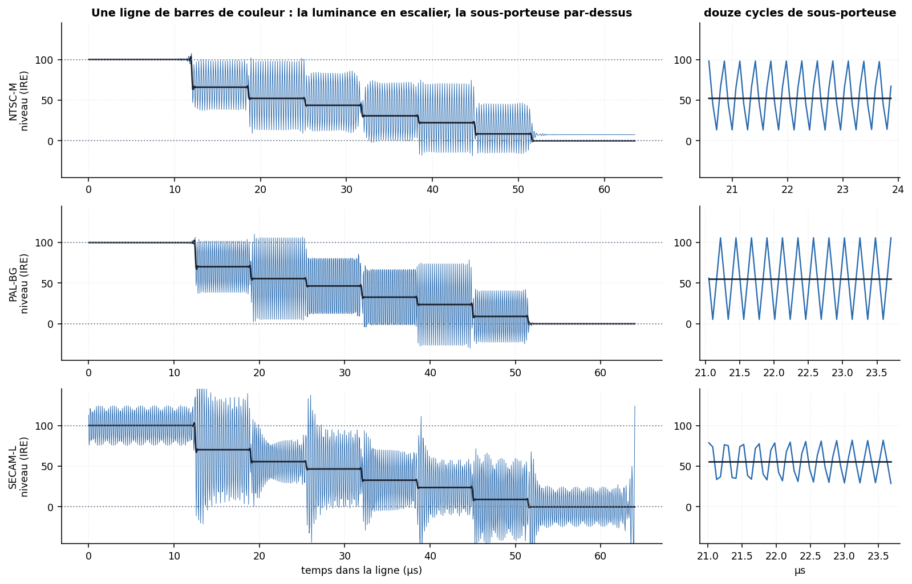

**Démodulation.** On multiplie par la référence locale :

$$
2\,C(t)\sin(\omega_{sc} t) = U\,(1 - \cos 2\omega_{sc} t) + V \sin 2\omega_{sc} t
\;\longrightarrow\; U + \text{termes à } 2\omega_{sc}
$$

$$
2\,C(t)\cos(\omega_{sc} t) = U \sin 2\omega_{sc} t + V\,(1 + \cos 2\omega_{sc} t)
\;\longrightarrow\; V + \text{termes à } 2\omega_{sc}
$$

Les produits à $2\omega_{sc}$ — vers 7,2 MHz — sont éliminés par le passe-bas
qui suit. Toute la précision du décodage repose donc sur **l'exactitude de
$\omega_{sc} t$**. Retenez cette phrase : c'est le sujet du chapitre 7.

> **Dans le code** — `porteuse.moduler_quadrature`, `porteuse.demoduler_quadrature`.

### 6.2 Le burst : d'où le récepteur tient sa référence de phase

Le récepteur doit régénérer localement une sous-porteuse **en phase** avec
celle de l'émetteur, alors que celle-ci n'est jamais transmise (porteuse
supprimée).

D'où le *burst* : neuf à dix cycles de sous-porteuse à phase de référence
(180°, soit l'axe $-U$), émis pendant le palier arrière de chaque ligne — dans
le temps de suppression, invisible à l'écran. Une boucle à verrouillage de
phase s'y accroche et maintient l'oscillateur local pendant les 52 µs de
l'image.

### 6.3 Les axes I et Q

NTSC ne module pas $U$ et $V$ directement, mais deux axes tournés de 33° :

$$
I = V\cos 33° - U\sin 33°, \qquad
Q = V\sin 33° + U\cos 33°
$$

soit, développé sur $R'G'B'$ :

$$
\begin{aligned}
I &= 0{,}596\,R' - 0{,}274\,G' - 0{,}322\,B' \\
Q &= 0{,}211\,R' - 0{,}523\,G' + 0{,}312\,B'
\end{aligned}
$$

Pourquoi 33° ? Parce que **l'acuité chromatique de l'œil n'est pas isotrope**.
Nous distinguons nettement mieux les variations fines le long de l'axe
orange–cyan que le long de l'axe vert–magenta. En alignant $I$ sur le premier
et $Q$ sur le second, on peut brider $Q$ beaucoup plus sévèrement :

| | bande | résolution horizontale utile |
|---|---|---|
| Luminance $Y'$ | 4,2 MHz | 442 points par ligne |
| $I$ (orange–cyan) | 1,3 MHz | 137 points par ligne |
| $Q$ (vert–magenta) | 0,4 MHz | **42 points par ligne** |

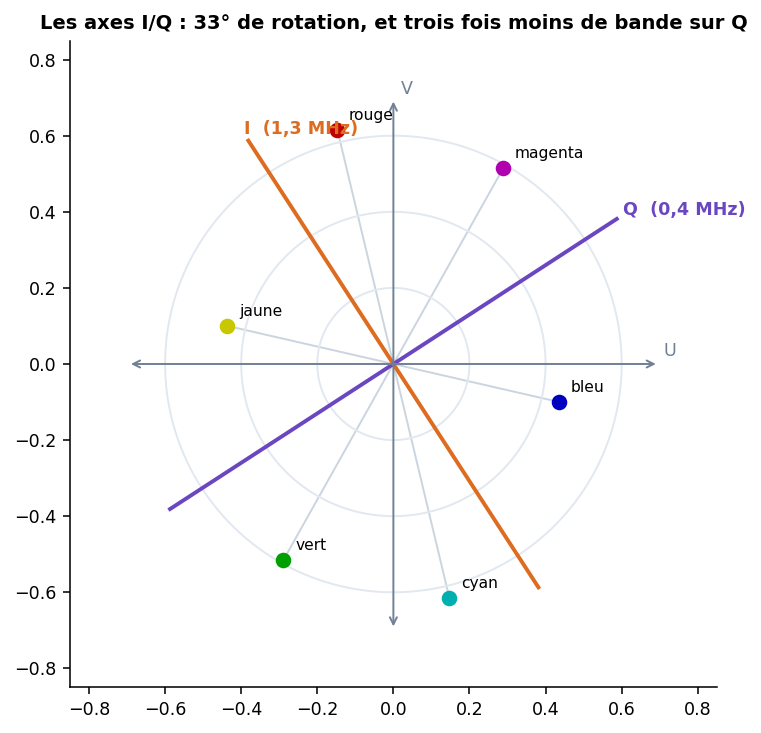

Quarante-deux points de couleur par ligne. Personne ne s'en est jamais plaint,
et c'est la meilleure démonstration qui soit de la faiblesse de notre vision
chromatique.

**Ironie de l'histoire** : cette subtilité coûtait un filtre asymétrique et un
retard à compenser. La quasi-totalité des récepteurs grand public l'a
ignorée et a décodé les deux axes à la même bande étroite — le décodage dit
« I/Q égal ». L'un des plus beaux raffinements de la norme n'a presque jamais
été mis en œuvre.

### 6.4 Le piédestal de 7,5 IRE

En NTSC-M américain, le niveau de noir n'est pas au niveau de suppression : il
est 7,5 IRE au-dessus. Ce *setup* était destiné à garantir qu'aucune tolérance
de fabrication ne fasse descendre le noir dans la zone des synchros.

Il comprime l'excursion utile de 7,5 % et, surtout, il exige que le récepteur
en tienne compte. Un récepteur mal réglé — ou un signal NTSC-J, sans
piédestal, affiché sur un récepteur NTSC-M — donne des noirs gris.

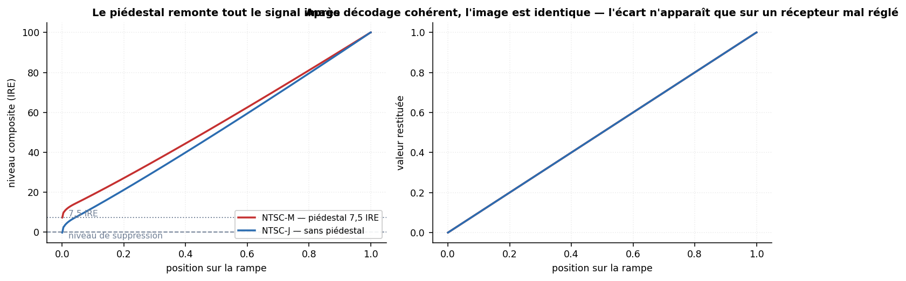

Le Japon a normalisé le NTSC sans piédestal, ce qui explique en partie la
réputation d'images plus contrastées du NTSC-J.

> **Vérifié par** — `tests/test_pipeline.py::test_le_piedestal_remonte_le_niveau_de_noir`.

---

## 7. Le péché du NTSC : l'erreur de phase

### 7.1 La démonstration, en trois lignes

Supposons que le canal ait fait tourner la sous-porteuse d'un angle $\theta$.
Le récepteur démodule avec sa référence, décalée de $\theta$. On obtient :

$$
\begin{pmatrix} U' \\ V' \end{pmatrix} =
\begin{pmatrix} \cos\theta & -\sin\theta \\ \sin\theta & \cos\theta \end{pmatrix}
\begin{pmatrix} U \\ V \end{pmatrix}
$$

Une **rotation pure**. Le module — la saturation — est parfaitement conservé.
L'argument — la teinte — a tourné de $\theta$.

Et rien, absolument rien, ne permet au récepteur de faire la différence entre
un vert qui a tourné de 20° et un vert-jaune authentique. L'information est
détruite sans laisser de trace.

> **Vérifié par** — `tests/test_porteuse.py::test_une_erreur_de_phase_fait_tourner_la_teinte`.

### 7.2 Pourquoi cela arrive : la phase différentielle

L'étage de puissance d'un émetteur n'est pas parfaitement linéaire. Le
déphasage qu'il introduit dépend du **niveau instantané** du signal qui le
traverse. C'est ce qu'on appelle la *phase différentielle*, et on la mesure en
degrés de sous-porteuse par unité de luminance.

Conséquence : un même objet, dans l'ombre et en pleine lumière, n'a plus la
même teinte. Un visage devient vert dans les hautes lumières et magenta dans
les basses. Sur une longue liaison à plusieurs bonds, les erreurs
s'accumulent.

D'où le bouton **Tint** (ou *Hue*), présent sur tous les téléviseurs
américains et sur aucun téléviseur européen : il permettait au spectateur de
rattraper à la main la dérive du jour. Et d'où le surnom, dans les régies :

> *NTSC — Never Twice the Same Color.*

### 7.3 Modélisation honnête

Dans ce simulateur, la phase différentielle n'est pas appliquée en faisant
tourner artificiellement un vecteur de chrominance. Ce serait tricher, et
surtout cela fausserait la comparaison avec le SECAM.

On applique au signal composite entier un **retard variable avec le niveau** :

$$\tau(t) = \frac{\Delta\varphi}{360°} \cdot \frac{1}{f_{sc}} \cdot \text{niveau}(t)$$

C'est physiquement ce qu'est une phase différentielle, et cela a une
conséquence voulue : le SECAM y est naturellement insensible, puisqu'un retard
constant ne change pas une fréquence instantanée. Il n'y a aucun traitement de
faveur — le même signal traverse le même canal.

> **Dans le code** — `canal._erreurs_differentielles`.

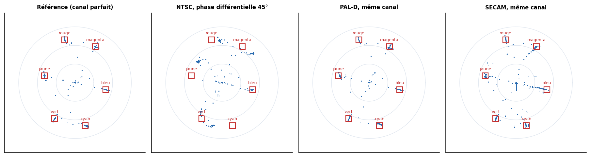

---

## 8. PAL

### 8.1 L'idée de Walter Bruch

*Phase Alternating Line.* À l'émission, **une ligne sur deux voit sa composante
$V$ inversée** :

$$C_n(t) = U \sin(\omega_{sc} t) \;\pm\; V \cos(\omega_{sc} t),
\qquad \text{signe} = (-1)^n$$

C'est tout. Une inversion de signe, un interrupteur électronique cadencé sur la
fréquence ligne. Et cela suffit à annuler l'erreur de phase.

### 8.2 La démonstration de l'annulation

Notons $s_n = \pm 1$ le signe de la ligne $n$. Le vecteur émis est $(U, s_n V)$.
Après une erreur de phase $\theta$ du canal, le récepteur démodule :

$$
\begin{aligned}
U'_n &= U\cos\theta - s_n V \sin\theta \\
V'_n &= s_n V\cos\theta + U \sin\theta
\end{aligned}
$$

Le récepteur, prévenu par le burst, rétablit le signe en multipliant $V'_n$
par $s_n$ (avec $s_n^2 = 1$) :

$$
\begin{aligned}
U'_n &= U\cos\theta - s_n V \sin\theta \\
V''_n &= V\cos\theta + s_n U \sin\theta
\end{aligned}
$$

Les termes parasites sont désormais **proportionnels à $s_n$**, donc de signes
opposés sur deux lignes consécutives. En moyennant la ligne $n$ et la ligne
$n-1$ :

$$
\bar U = U\cos\theta, \qquad \bar V = V\cos\theta
$$

$$
\boxed{\text{Erreur de teinte : nulle. Erreur de saturation : un facteur } \cos\theta.}
$$

C'est le tour de force du PAL : il ne supprime pas l'erreur, il la **convertit**
en une erreur d'une autre nature. Une dérive de teinte de 30° saute aux yeux ;
une perte de saturation de $1 - \cos 30° = 13\,\%$ est invisible.

> **Vérifié par** — `tests/test_porteuse.py::test_le_pal_annule_l_erreur_de_phase_en_moyennant_deux_lignes`,
> qui contrôle l'annulation à $10^{-9}$ près sur l'argument.

### 8.3 PAL-S et les barres de Hanover

Les premiers récepteurs PAL n'avaient pas de ligne à retard — un composant
coûteux à l'époque : une barre de verre de 64 µs de temps de propagation
ultrasonore. Ils s'en remettaient à **l'œil du spectateur** pour faire la
moyenne, en misant sur le fait que deux lignes voisines sont indiscernables à
distance normale. C'est le PAL-S, pour *simple*.

Cela fonctionne — tant que l'erreur reste petite. Au-delà, l'alternance de
teinte devient visible sous forme d'un striage horizontal : les **barres de
Hanover**, du nom de la ville où Bruch travaillait.

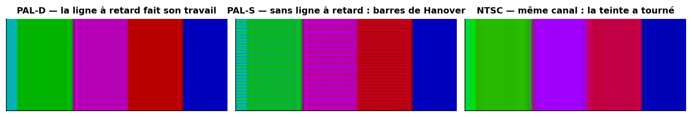

À erreur identique, le NTSC (à droite) a vu toute son image dériver, le PAL-D
(à gauche) est intact, le PAL-S (au milieu) affiche des couleurs justes en
moyenne mais striées.

Le PAL-D — *delay* — généralise la ligne à retard et fait la moyenne
électroniquement. C'est ce que faisait tout récepteur à partir des années 1970.

> **Vérifié par** — `tests/test_pipeline.py::test_les_barres_de_hanover_apparaissent_sans_ligne_a_retard`.

### 8.4 Ce que le PAL paie

La moyenne de deux lignes n'est pas gratuite : **la résolution chromatique
verticale est divisée par deux.** En PAL-D, deux lignes consécutives partagent
leur chrominance.

Personne ne s'en est aperçu, pour la même raison que les 42 points de couleur
par ligne du NTSC : l'acuité chromatique de l'œil est trop faible pour en
souffrir. Mais c'est bien une perte, définitive, et le chapitre 11 la chiffre.

Le PAL paie aussi une seconde chose : **il est plus complexe**. Un interrupteur
de phase à l'émission, un burst oscillant, une ligne à retard et un
commutateur au récepteur. Cette complexité a longtemps été l'argument des
partisans du NTSC.

### 8.5 Le burst oscillant

Comment le récepteur sait-il quel est le signe de $V$ sur la ligne qui suit ?
Par le burst, dont la phase oscille de ±45° autour de la référence 180° :
**135° ou 225°**. Le récepteur en déduit à la fois sa référence de phase (la
moyenne des deux, 180°) et le signe de la ligne.

Sans cette indication, le récepteur afficherait les couleurs complémentaires
une ligne sur deux.

> **Dans le code** — `porteuse.signe_pal`, `porteuse.phase_burst_pal`.

---

## 9. SECAM

### 9.1 Un pari radicalement différent

Henri de France part du même constat que Bruch — l'erreur de phase est le
fléau du NTSC — mais en tire la conclusion inverse. Plutôt que de compenser
l'erreur de phase, **supprimons la phase comme porteuse d'information**.

*Séquentiel Couleur À Mémoire.* Deux décisions, chacune radicale :

1. **Séquentiel** : on n'émet plus les deux composantes en même temps. Chaque
   ligne n'en porte qu'une, en alternance : $D'_B$, puis $D'_R$, puis $D'_B$…
2. **À mémoire** : le récepteur conserve la ligne précédente dans une ligne à
   retard de 64 µs, et reconstitue ainsi le couple manquant.

Et puisqu'une seule composante occupe la ligne, on peut se permettre une
**modulation de fréquence**, qui aurait été impensable pour deux signaux
simultanés.

### 9.2 Le matriçage

$$D'_B = +1{,}505\,(B'-Y'), \qquad D'_R = -1{,}902\,(R'-Y')$$

Les facteurs sont plus grands qu'en PAL parce que l'amplitude n'a plus à
cohabiter avec la luminance dans la même excursion — c'est la fréquence qui
porte l'information. Le signe négatif de $D'_R$ est un choix de norme qui
équilibre les excursions positives et négatives après préaccentuation.

### 9.3 La modulation de fréquence

Deux sous-porteuses, une par type de ligne :

$$f_{OB} = 4{,}250\ \text{MHz}\ (272 f_H), \qquad f_{OR} = 4{,}406\,25\ \text{MHz}\ (282 f_H)$$

La fréquence instantanée s'écarte du repos proportionnellement au signal :

$$f(t) = f_{O\!X} + \Delta_X \cdot D'_X(t)$$

avec $\Delta_B = 280$ kHz et $\Delta_R = 230$ kHz par unité, et un écrêtage de
l'excursion à $-506$ / $+350$ kHz.

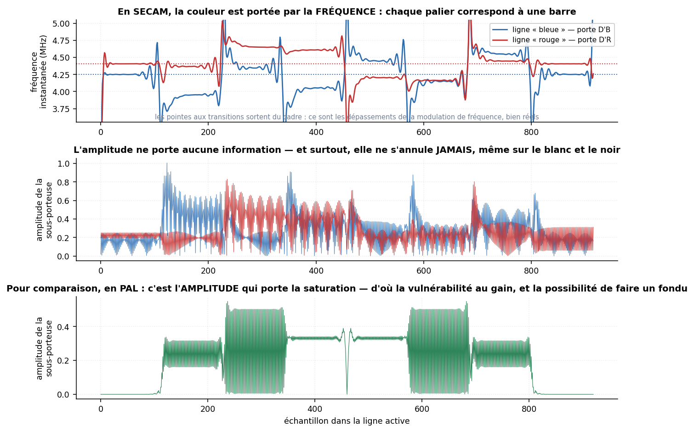

Le panneau du haut montre la fréquence instantanée réellement mesurée sur le
signal simulé : chaque palier correspond à une barre de couleur. Le panneau du
bas montre, pour comparaison, un signal PAL où c'est **l'amplitude** qui porte
la saturation.

Comparez les deux panneaux inférieurs. En PAL, l'amplitude tombe **exactement à
zéro** sur le blanc et sur le noir. En SECAM, elle ne s'annule jamais.

### 9.4 La préaccentuation basse fréquence

Avant modulation, le signal de différence de couleur passe dans un filtre qui
relève ses hautes fréquences :

$$A(f) = \frac{1 + j f/f_1}{1 + j f/(3 f_1)}, \qquad f_1 = 85\ \text{kHz}$$

Gain unité en continu, plafond à un rapport 3 (9,5 dB) en haute fréquence. Au
décodage, la désaccentuation inverse rabaisse ces fréquences — **et avec elles
le bruit que le canal y a déposé**. C'est rigoureusement le principe du Dolby B
sur une cassette audio.

### 9.5 Le filtre cloche : l'astuce qui rend le SECAM regardable

Nous avons vu au §5.5 que les sous-porteuses SECAM tombent sur les raies de
luminance, sans le moindre entrelacement. Et §9.3 que la porteuse est émise en
permanence, même sur du gris. Sans précaution, un mur blanc afficherait donc un
motif de sous-porteuse parfaitement visible.

D'où le **filtre cloche**, appliqué à la sous-porteuse déjà modulée :

$$G(F) = M_0\,\frac{1 + 16\,jF}{1 + 1{,}26\,jF},
\qquad F = \frac{f}{f_0} - \frac{f_0}{f},
\qquad f_0 = 4{,}286\ \text{MHz}$$

$f_0$ est placé à mi-chemin entre les deux sous-porteuses, et la courbe a la
forme d'une cloche **inversée** : minimum au repos, remontée de part et d'autre.

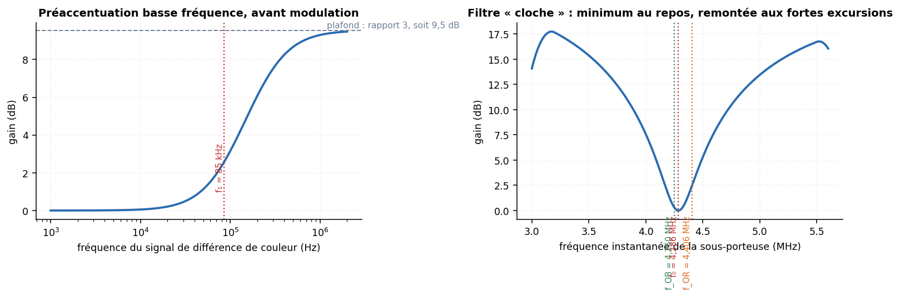

Le résultat est exactement ce qu'on cherche :

> Plus la couleur est proche du gris, plus la fréquence instantanée est proche
> du repos, **et plus la sous-porteuse est atténuée**.

Sur les zones neutres — c'est-à-dire la majeure partie d'une image ordinaire —
le motif devient discret. Sur les zones saturées, il est plus fort, mais la
couleur elle-même le masque.

Mesuré sur le simulateur : l'amplitude crête de la sous-porteuse vaut 0,25 au
repos contre 0,64 à pleine excursion, soit un rapport de 2,6.

> **Vérifié par** — `tests/test_pipeline.py::test_secam_emet_sa_sous_porteuse_meme_sur_du_gris`.

### 9.6 Le décodage

1. passe-bande autour de 3,35 – 5,3 MHz ;
2. **anti-cloche**, inverse exact de la préaccentuation haute fréquence,
   appliqué **avant** le limiteur puisqu'il rétablit de l'amplitude ;
3. **limiteur** puis **discriminateur de fréquence** — dans le simulateur, un
   détecteur à quadrature : on ramène la sous-porteuse en bande de base avec un
   oscillateur local à la fréquence de repos, et l'écart de fréquence est la
   dérivée de l'argument du vecteur complexe obtenu. Prendre l'argument, c'est
   ignorer complètement le module : **le limiteur, gratuitement** ;
4. désaccentuation basse fréquence ;
5. **mémoire de ligne** : la composante manquante vient de la ligne précédente.

> **Dans le code** — `decodeur._decoder_secam`, `porteuse.demoduler_frequence`.

### 9.7 Les forces et les faiblesses, sans complaisance

**Ce que le SECAM gagne.**

- **Immunité totale aux erreurs de phase.** Un retard ne change pas une
  fréquence. Mesuré sur le simulateur : à 60° de phase différentielle, l'erreur
  de teinte SECAM est de 0,0° et la perte de saturation de 0,8 %, contre 17° de
  dérive de teinte en NTSC.
- **Immunité aux erreurs de gain.** Le limiteur écrase toute information
  d'amplitude avant le discriminateur.
- **Excellente tenue sur les longues liaisons** à multiples bonds — argument
  décisif pour un pays au relief accidenté et au réseau très ramifié.

> **Vérifié par** — `tests/test_pipeline.py::test_reponse_des_trois_normes_a_la_phase_differentielle`
> et `::test_secam_ignore_le_gain_differentiel`.

**Ce que le SECAM perd.**

- **La résolution chromatique verticale, divisée par deux**, comme le PAL-D —
  mais ici c'est structurel et irrécupérable : l'information n'a jamais été
  émise.
- **La compatibilité parfaite avec le noir et blanc.** La porteuse est toujours
  là.
- **Et surtout : on ne peut rien faire d'un signal SECAM.** Aucun fondu, aucun
  mélange, aucune incrustation, aucun trucage. Additionner deux signaux FM ne
  produit pas la somme des couleurs ; en atténuer un ne le désature pas, cela
  ne fait qu'affaiblir la porteuse. Les régies françaises travaillaient donc en
  composantes ou en PAL, et ne codaient en SECAM qu'au tout dernier moment,
  à l'émission.

C'est là le vrai jugement porté sur le SECAM par l'histoire : excellent pour
**transmettre**, inutilisable pour **produire**.

### 9.8 L'identification

Comment le récepteur sait-il si la ligne courante porte $D'_B$ ou $D'_R$ ? Par
des signaux d'identification placés dans la suppression : d'abord des
« bouteilles » — des salves à fréquence variable réparties sur neuf lignes de
la suppression trame — puis, à partir des années 1970, des salves de référence
aux fréquences de repos placées sur le palier arrière de chaque ligne.

---

## 10. Décoder : réjecteur, peigne, et les artefacts qui en naissent

Le récepteur reçoit un seul signal, $S = Y' + C$, et doit en extraire deux. La
tâche est **fondamentalement impossible à faire exactement** : les deux spectres
s'interpénètrent. Tout séparateur est un compromis, et chaque compromis engendre
son artefact.

### 10.1 Le réjecteur

Le plus simple : un filtre coupe-bande centré sur la sous-porteuse.

$$Y'_{\text{estimée}} = \text{coupe-bande}_{f_{sc}}(S), \qquad
  C_{\text{estimée}} = \text{passe-bande}_{f_{sc}}(S)$$

Détail qui a son importance et que beaucoup de simulateurs manquent : ces deux
filtres sont **indépendants**, pas complémentaires. Un vrai piège LC est étroit
(±0,6 MHz), tandis que la voie chroma est large (±1,3 MHz). Leur somme ne
reconstitue pas le composite.

Si l'on imposait la complémentarité, le piège devrait être aussi large que la
bande de chrominance et avalerait toute trace de sous-porteuse : **aucun dot
crawl n'apparaîtrait**. On aurait simulé un téléviseur qui n'a jamais existé.

> **Dans le code** — `decodeur.LARGEUR_TRAP` et la docstring qui l'accompagne.

**Le coût.** Toute la luminance située dans la bande rejetée disparaît. Une
chemise à fines rayures perd sa texture. Et les bandes latérales de la
chrominance, elles, passent dans la voie luminance : c'est le **dot crawl**.

### 10.2 Le filtre en peigne

En NTSC, la sous-porteuse tourne exactement de 180° d'une ligne à la suivante.
La chrominance change donc de signe, tandis que la luminance, elle, reste
presque identique. D'où :

$$
Y' = \frac{L_n + L_{n-1}}{2}, \qquad
C = \frac{L_n - L_{n-1}}{2}
$$

Une soustraction, une addition, et une ligne à retard. La séparation est
**exacte** partout où l'hypothèse « la luminance ne change pas d'une ligne à
l'autre » est vraie — c'est-à-dire partout sauf sur les contours horizontaux.

**En PAL**, une ligne de retard ne convient pas : l'avance de phase vaut
270,576°, pas 180°. Mais sur **deux** lignes elle vaut $2 \times 270{,}576 =
541{,}15° \equiv 181{,}15°$ modulo un tour — assez proche de l'inversion pour
que le peigne fonctionne. C'est exactement pourquoi les peignes PAL utilisent
un retard de 2H (128 µs) là où les peignes NTSC se contentent de 1H.

**En SECAM**, aucun peigne n'est possible : les sous-porteuses étant des
multiples entiers de $f_H$, elles retombent en phase à chaque ligne et ne
s'inversent jamais.

> **Vérifié par** — `tests/test_porteuse.py::test_ntsc_tourne_de_180_degres_par_ligne`
> et `::test_pal_tourne_de_270_degres_par_ligne`.

### 10.3 Le dot crawl : le peigne ne le supprime pas, il le déplace

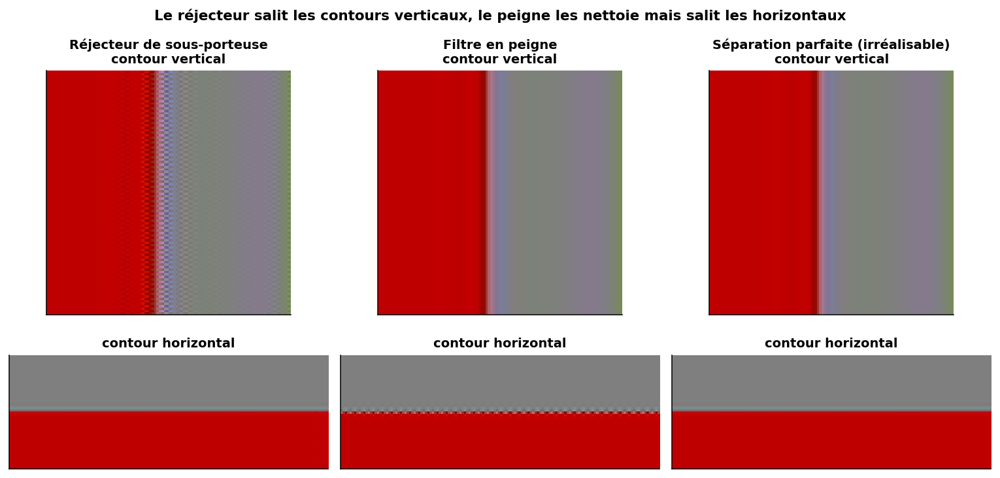

C'est l'une des figures les plus instructives de ce cours, et elle mérite qu'on
s'y arrête.

- **Réjecteur** (colonne de gauche) : le motif de points apparaît sur les
  contours **verticaux** des aplats colorés. Là, la chrominance a des bandes
  latérales larges qui débordent du piège étroit et fuient dans la luminance.
- **Peigne** (colonne du milieu) : ces contours-là sont impeccables. Mais
  l'hypothèse de similarité entre lignes s'effondre sur les contours
  **horizontaux**, où le motif réapparaît en damier.
- **Séparation parfaite** (colonne de droite) : ni l'un ni l'autre. Ce décodeur
  n'existe pas ; il sert de référence pour mesurer ce que les deux autres
  coûtent.

Mesuré sur le simulateur : sur le flanc vertical d'un pavé rouge, l'alternance
ligne à ligne de la luminance vaut 0,065 avec le réjecteur et 0,000 avec le
peigne. Sur l'arête horizontale, c'est l'inverse : 0,0001 contre 0,022.

> **Vérifié par** — `tests/test_pipeline.py::test_le_dot_crawl_apparait_et_le_peigne_le_deplace`.

### 10.4 Le cross-color

L'artefact symétrique. Si de la chrominance peut fuir dans la voie luminance,
de la luminance peut fuir dans la voie chrominance.

Un détail fin de l'image — une veste à rayures, une grille, un toit de tuiles —
produit dans le signal une composante à haute fréquence spatiale. Si cette
fréquence tombe près de la sous-porteuse, **le décodeur n'a aucun moyen de
savoir qu'il s'agit de luminance**. Il la démodule, et sort une couleur.

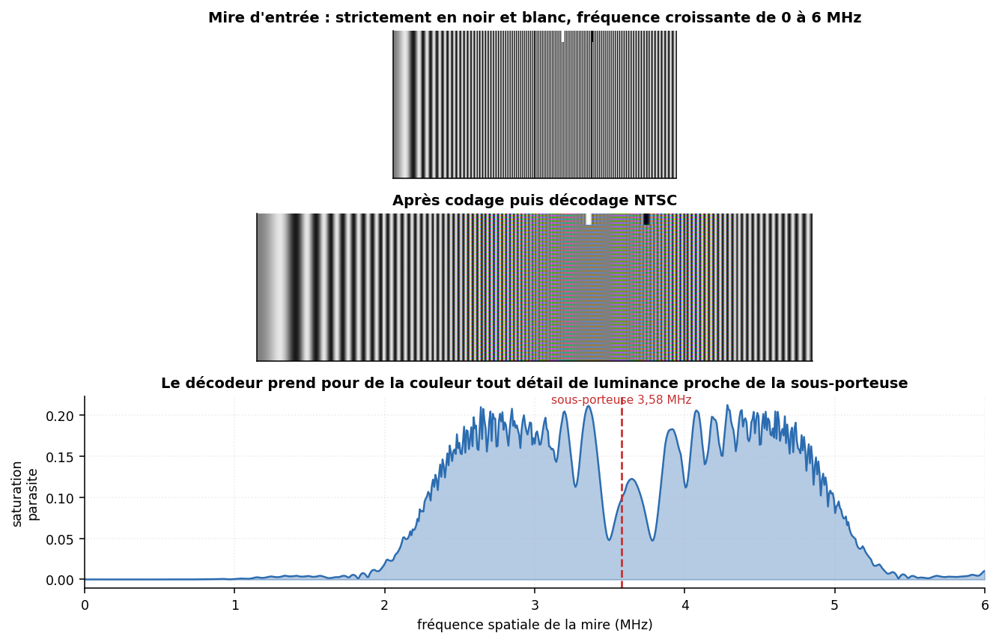

La mire d'entrée est **strictement en noir et blanc** : sa fréquence spatiale
croît linéairement de 0 à 6 MHz. La courbe du bas mesure la saturation
parasite qui en ressort. Elle est nulle en basse fréquence, culmine autour de
la sous-porteuse, retombe au-delà.

C'est la hantise des présentateurs de journal télévisé, à qui l'on interdisait
les vestes à fines rayures et les cravates à motifs serrés.

> **Vérifié par** — `tests/test_pipeline.py::test_le_cross_color_colore_une_mire_en_noir_et_blanc`,
> qui contrôle qu'une mire monochrome ressort avec une saturation supérieure à
> 0,15 sur plus de 10 % de sa surface.

### 10.5 Le comportement au bruit

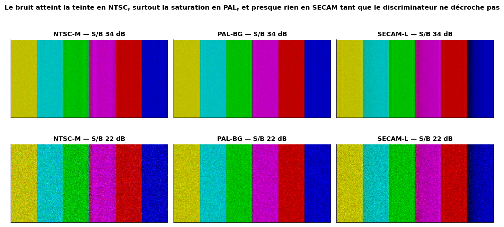

Trois signatures différentes pour le même bruit :

- **NTSC** — le bruit perturbe la phase, donc la **teinte**. Les aplats
  colorés se mettent à moucheter en couleurs voisines.
- **PAL** — la ligne à retard convertit une partie de ce bruit de phase en
  bruit de saturation, moins visible. En revanche la moyenne de deux lignes
  bruitées améliore de 3 dB le rapport signal/bruit chromatique : le PAL est
  franchement meilleur que le NTSC sur ce terrain.
- **SECAM** — le discriminateur ignore le bruit tant qu'il reste inférieur au
  signal. Les couleurs restent parfaitement saturées et stables alors que la
  luminance, elle, est déjà bien grenue. Mais quand le bruit devient assez
  fort pour faire **décrocher** le discriminateur, l'écart de fréquence part
  brutalement et produit des taches colorées vives et isolées : le « feu »
  caractéristique des images SECAM très bruitées.

---

## 11. Ce que tout cela fait au RGB d'origine

Chapitre de synthèse. On rassemble ici tout ce que la chaîne a prélevé sur
l'image de départ, dans l'ordre où elle le prélève, avec les chiffres mesurés.

### 11.1 La non-constant-luminance

C'est la perte la plus profonde, et la moins connue.

Le codeur calcule $Y'$ à partir de composantes **déjà gamma-corrigées**. La
luminance que transporte réellement la voie $Y$ n'est donc pas la luminance de
la couleur, mais $(Y')^\gamma$. Ces deux quantités ne coïncident que sur les
gris — car $x^\gamma$ n'est pas linéaire, et la moyenne des racines n'est pas
la racine de la moyenne.

Sur les couleurs saturées, l'écart est vertigineux :

| Couleur | Part de la luminance portée par $Y'$ ($\gamma = 2{,}2$) | ($\gamma = 2{,}8$) |
|---|---|---|
| Jaune | 86,5 % | 80,4 % |
| Cyan | 65,3 % | 52,8 % |
| Vert | 52,8 % | 38,3 % |
| Magenta | 34,6 % | 20,4 % |
| Rouge | 23,5 % | 11,4 % |
| **Bleu** | **7,4 %** | **2,0 %** |
| Gris | 100,0 % | 100,0 % |

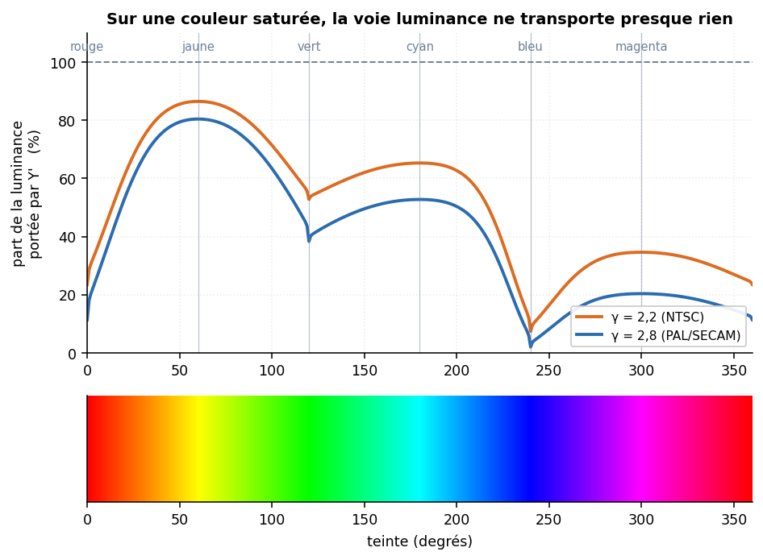

Sur un bleu saturé en PAL, **98 % de la luminance de la couleur voyage dans les
signaux de chrominance** — que l'on va justement filtrer à 1,3 MHz, six fois
moins large que la luminance.

C'est pour cela que les rouges et les bleus saturés de la télévision analogique
sont mous, baveux, et qu'un générique en lettres rouges sur fond noir est
illisible. Ce n'est pas un défaut de réglage : c'est inscrit dans le principe
même du système.

> **Dans le code** — `mesures.bilan_luminance`.
> **Vérifié par** — `tests/test_pipeline.py::test_bilan_de_non_constant_luminance`.

### 11.2 La résolution horizontale de la couleur

Une bande de $B$ hertz sur une ligne active de durée $T$ porte $B \cdot T$
alternances, soit $2BT$ points utiles.

| | Luminance | Chrominance 1 | Chrominance 2 |
|---|---|---|---|
| NTSC-M | 4,2 MHz → **442 pts/ligne** | $I$ : 1,3 MHz → 137 | $Q$ : 0,4 MHz → **42** |
| PAL-B/G | 5,0 MHz → **520 pts/ligne** | $U$ : 1,3 MHz → 135 | $V$ : 1,3 MHz → 135 |
| SECAM-L | 6,0 MHz → **623 pts/ligne** | $D'_B$ : 1,5 MHz → 156 | $D'_R$ : 1,5 MHz → 156 |

Autrement dit : **environ quatre fois moins de définition en couleur qu'en
luminance**, horizontalement. Une transition franche de couleur met quatre fois
plus de temps à s'établir qu'une transition de luminance.

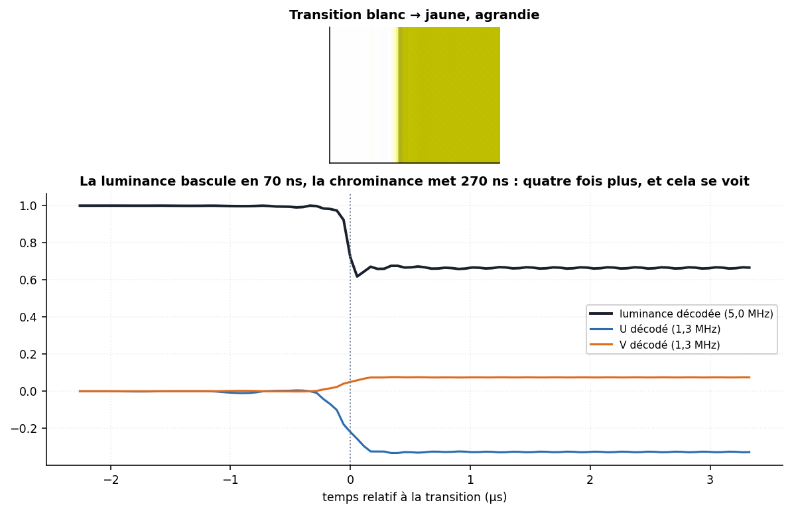

Sur cette transition blanc → jaune mesurée, la luminance bascule en 70 ns
(temps de montée $0{,}35/B$ pour 5 MHz), la chrominance en 270 ns. La couleur
déborde donc du contour, et c'est très exactement ce que l'on voit quand un
générique rouge « bave » sur le noir.

> **Vérifié par** — `tests/test_pipeline.py::test_la_chrominance_bave_horizontalement`.

### 11.3 La résolution verticale de la couleur

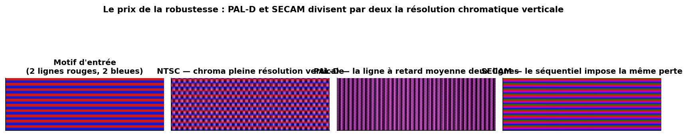

| | Lignes de chrominance |
|---|---|
| NTSC | 480 — pleine résolution |
| PAL-S (sans ligne à retard) | 576 — pleine résolution |
| **PAL-D** | **288** — la ligne à retard moyenne deux lignes |
| **SECAM** | **288** — le séquentiel n'en transmet qu'une sur deux |

PAL-D et SECAM paient tous deux leur robustesse de la même monnaie, pour des
raisons différentes : le PAL par le traitement du récepteur, le SECAM par
l'émission elle-même.

### 11.4 Les artefacts de diaphotie

Récapitulés au chapitre 10 : dot crawl, cross-color, motif de sous-porteuse.
Ils n'enlèvent rien à l'information — ils en **ajoutent** qui n'y était pas.
C'est pire, à certains égards, qu'une simple perte de résolution : une image
floue reste une image juste ; une image qui invente des couleurs est une image
fausse.

### 11.5 La rotation de teinte et la perte de saturation

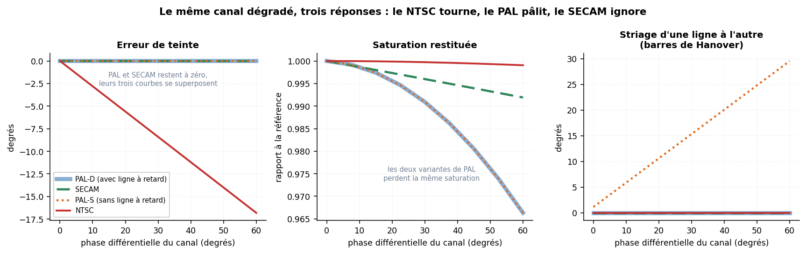

Cette figure est la synthèse quantitative de tout le cours. Le même canal
dégradé traverse les trois normes ; seule la façon de coder la couleur diffère.

| Phase différentielle du canal | 60° |
|---|---|
| NTSC — erreur de teinte | **−17°** |
| PAL-D — erreur de teinte | 0,0° |
| PAL-D — perte de saturation | 3,4 % |
| PAL-S — striage ligne à ligne | **30°** (barres de Hanover) |
| SECAM — erreur de teinte | 0,0° |
| SECAM — perte de saturation | 0,8 % |

### 11.6 L'écrêtage hors gamut

Après matriçage inverse, rien ne garantit que le triplet $(R', G', B')$ obtenu
soit dans le cube $[0,1]^3$. Le bruit, la limitation de bande, les dépassements
des filtres poussent régulièrement les valeurs au-delà.

Le tube ne sait pas produire une luminance négative, ni plus de lumière que son
maximum. On écrête. Et **l'écrêtage d'un seul canal déplace la teinte** : il ne
se contente pas de désaturer.

Mesuré sur une mire de barres à 75 %, avec un canal parfait : 24 % des pixels
en PAL, 31 % en NTSC sont écrêtés d'au moins un échelon sur huit bits — presque
exclusivement dans les zones de transition, où le dépassement atteint 0,29.

### 11.7 Le niveau de noir

Le piédestal de 7,5 IRE du NTSC-M comprime l'excursion utile d'autant. La
chaîne complète le compense correctement, mais toute désadaptation entre
l'émission et le récepteur se traduit par un noir gris ou des basses lumières
bouchées.

### 11.8 La dérive colorimétrique

Enfin, si l'image d'origine est interprétée dans les primaires de la norme
(§2.2), une désaturation globale s'ajoute à tout le reste — spectaculaire avec
les primaires NTSC 1953.

### 11.9 Le bilan chiffré

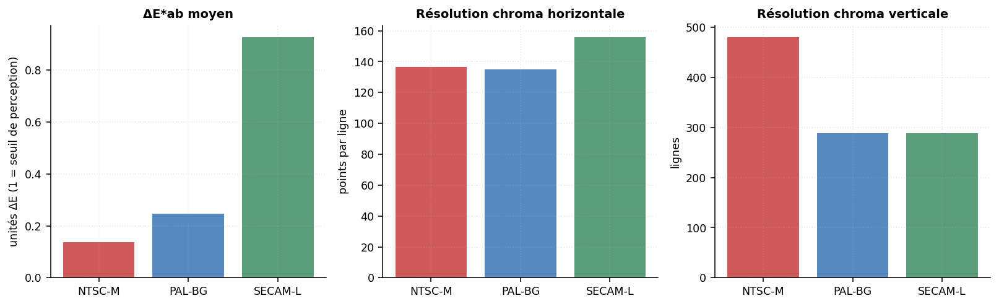

Et, sur une image continue plutôt qu'une mire, le résultat visuel :

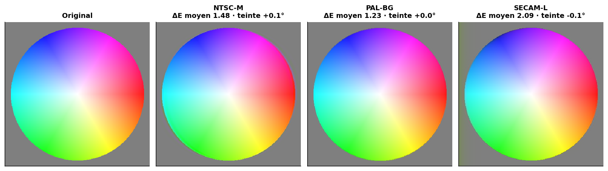

**Écart colorimétrique moyen ΔE\*ab**, canal parfait, décodeur normal :

| Mire | NTSC-M | PAL-B/G | SECAM-L |
|---|---|---|---|
| Barres de couleur 75 % | 4,11 | **2,51** | 7,14 |
| Roue de teintes | 1,43 | **1,03** | 2,20 |
| Dégradé de saturation | **0,14** | 0,25 | 0,93 |

Rappel d'échelle : $\Delta E \approx 1$ est le seuil de perception d'un
observateur entraîné, $\Delta E \approx 3$ une différence évidente pour
quiconque.

**Comment lire ce tableau.** Les mires de barres et la roue de teintes sont
saturées de transitions franches : elles mesurent surtout le comportement aux
contours, où le SECAM est le plus faible (FM plus étalée, mémoire de ligne).
Le dégradé de saturation, lui, est presque partout plat : il mesure la
fidélité en régime établi, et l'ordre s'inverse — le NTSC y est le meilleur,
parce qu'il ne perd rien verticalement.

Et surtout : ces chiffres décrivent un **canal parfait**. C'est précisément la
situation qui n'existe jamais. Dès que le canal se dégrade — et c'était la
règle en hertzien, en réception d'antenne râteau, après plusieurs bonds de
faisceau — le classement change du tout au tout, comme le montre le §11.5.

> **C'est là toute la leçon de ce cours.** Chacun des trois systèmes est
> optimal pour la question qu'il s'est posée. Le NTSC a choisi la simplicité et
> l'a payée en fidélité de teinte. Le PAL a choisi de compenser et l'a payé en
> complexité et en résolution verticale. Le SECAM a choisi la robustesse et l'a
> payée en flexibilité de production. Aucun des trois n'a eu tort.

---

## 12. Les shaders : la même chaîne, en temps réel

Tout ce qui précède a été démontré sur une bibliothèque numpy qui prend
quelques centaines de millisecondes par image. C'est parfait pour comprendre,
et inutilisable pour regarder un film.

Ce chapitre porte la même chaîne sur carte graphique. L'exercice n'a d'intérêt
que si la contrainte est tenue jusqu'au bout : **le shader ne doit pas peindre
les artefacts**, il doit refaire le calcul. Un moirage dessiné à la main serait
plus rapide encore et n'apprendrait rien. La figure 21 mesure si le pari est
tenu.

### 12.1 Ce qu'un fragment shader sait faire, et ce qu'il ne sait pas

Un *fragment shader* est une fonction appelée une fois par pixel, en parallèle,
sans ordre garanti. De cette définition découlent trois interdits :

1. **Pas de récursivité entre pixels.** Un filtre récursif calcule
   $y_n = \sum a_k y_{n-k} + \sum b_k x_{n-k}$ : chaque sortie a besoin des
   précédentes. Impossible. Tous les filtres deviennent non récursifs.
2. **Pas d'accumulation le long d'une ligne.** Or la modulation de fréquence
   du SECAM est *par définition* une intégrale depuis le début de la ligne.
3. **Pas d'état d'une image à l'autre**, sinon en écrivant dans une texture et
   en la relisant à la passe suivante.

En échange, on obtient plusieurs milliers de cœurs et une bande passante de
texture qui se compte en centaines de gigaoctets par seconde. Toute la
conception consiste à échanger de la séquentialité contre du parallélisme.

Même la géométrie disparaît. Il n'y a ni maillage, ni tampon de sommets : un
seul triangle, dont les coordonnées sont déduites de `gl_VertexID`, couvre
l'écran. Un triangle plutôt que deux, parce que le matériel rasterise par
tuiles de 2×2 fragments et que la diagonale d'un quadrilatère fait calculer
deux fois les fragments qu'elle traverse.

> **Dans le code** — `shaders/sommet.vert`, dix lignes en tout.

### 12.2 Le trajet, en passes

Chaque passe lit une ou plusieurs textures et en écrit une. La chaîne complète :

```
image source (RGB 8 bits, n'importe quelle taille)
  |
  +- NTSC / PAL ------------------------------------------------+
  |    passe CODAGE      matriçage, filtrage, modulation         |
  |                      -> composite (R16F, 753x480 ou 921x576) |
  |                                                              |
  +- SECAM -------------------------------------------------+   |
  |    passe PRÉPARATION  matriçage, filtrage, écart de fréq.|   |
  |                       -> (écart, luma)   RG32F           |   |
  |    10 passes SCAN     somme préfixe de l'écart           |   |
  |                       -> intégrale de phase   R32F       |   |
  |    passe CODAGE       synthèse de la porteuse FM         |   |
  |                       -> composite (R16F, 916x576)       |   |
  |                                                          v   v
  |    passe DÉCODAGE    séparation Y/C, démodulation, matriçage inverse
  |                      -> résultat (RGBA8, géométrie de la norme)
  |
  +- halo (facultatif, 3 passes au quart de résolution)
  |    extraction + réduction -> flou horizontal -> flou vertical
  |
  +- passe PRÉSENTATION  courbure, réponse du tube, halo, lignes,
                         masque -> fenêtre
```

Deux passes suffisent au NTSC et au PAL ; le SECAM en demande treize. Le
chapitre 9 avait annoncé qu'il était la norme la plus coûteuse à décoder — le
compte des passes le confirme, et pour exactement la même raison.

> **Dans le code** — `lecteur/vue_gl.py`, méthodes `_passe_preparation`,
> `_passes_scan`, `_passe_codage`, `_passe_decodage`, `_passes_halo`,
> `_passe_presentation`.

**La grille de calcul ne dépend pas de l'image source.** Une vidéo 1920×1080
est rééchantillonnée dans la grille de la norme — 921×576 en PAL, quatre points
par cycle de sous-porteuse — puis restituée à la taille de la fenêtre. C'est le
téléviseur qui impose sa définition, pas le fichier, et c'est bien ainsi que
les choses se passaient.

### 12.3 L'horloge de sous-porteuse, et un piège de précision simple

C'est la fonction la plus courte du projet, et la plus critique :

$$\varphi(x, n) = 2\pi \left\{
  \underbrace{\{\alpha\}}_{\text{image}} +
  \underbrace{\left\{ \left\{\tfrac{f_{sc}}{f_H}\right\} \cdot n \right\}}_{\text{ligne } n} +
  \underbrace{f_{sc} T_{\text{active}} \cdot x}_{\text{position } x}
\right\}$$

où $\{\cdot\}$ désigne la partie fractionnaire. Tout le comportement temporel
des trois normes est là-dedans : les 180° par ligne du NTSC, les 270,576° du
PAL, les 0° du SECAM, le rampement des points d'une image à l'autre.

**Le piège.** Il serait naturel de calculer $f_{sc}/f_H \times n$ puis de
prendre la partie fractionnaire à la fin. En PAL, $283{,}7516 \times 576 =
163\,441$. Or un flottant simple précision n'a que 24 bits de mantisse : à
cette grandeur, l'écart entre deux valeurs représentables — l'*ulp* — vaut
$2^{17-23} = 0{,}015\,625$ cycle, c'est-à-dire **5,6° de teinte**. La rotation
serait juste en haut de l'image et fausse en bas.

En réduisant modulo 1 **terme à terme**, la valeur reste dans $[0, 1[$ où l'ulp
vaut $6 \cdot 10^{-8}$ : l'erreur tombe sous le millionième de degré. La double
précision n'existe pas dans un fragment shader ; il fallait donc que
l'arithmétique soit bonne, pas que le format soit large.

> **Dans le code** — `shaders/commun.glsl`, fonction `phase()`.

### 12.4 Du filtre récursif au filtre non récursif

`tvcolor` limite les bandes avec des Butterworth d'ordre 4 appliqués
aller-retour (`sosfiltfilt`) : récursifs, à phase nulle, fidèles au réseau LC
d'un vrai récepteur. Le shader n'a pas le droit d'être récursif. Il lui faut
donc un filtre à réponse impulsionnelle finie, et le choisir demande plus de
soin qu'il n'y paraît.

**Le réflexe qui échoue.** Un sinus cardinal fenêtré — de Blackman, de
Hamming — est la recette classique. Mesuré à 31 coefficients, il perd **2,9 dB
à 1 MHz** là où la référence n'en perd que 0,95. Le temps de montée passe de
neuf points à six, toutes les transitions de couleur s'élargissent, et sur le
SECAM — où l'écart se cumule avec la modulation de fréquence et la mémoire de
ligne — les franges deviennent franchement voyantes.

**La solution.** On ne part pas d'un gabarit idéal, on **synthétise le noyau
pour qu'il épouse la réponse du Butterworth aller-retour** de la référence,
module au carré compris :

$$|H_{\text{FIR}}(f)| \;\longleftarrow\; |H_{\text{Butterworth}}(f)|^2$$

Les deux chaînes se répondent alors par construction, et non par chance.

**Le réjecteur est un tout autre problème.** Un passe-bas n'a qu'un flanc à
former ; un réjecteur en a deux, encadrant une bande étroite. Mesuré sur la
bande SECAM :

| coefficients | fenêtrage | Parks-McClellan (`remez`) |
|---|---|---|
| 21 | −11 dB | — |
| 41 | −16 dB | **−34 dB** |
| 61 | — | −45 dB |

Seize décibels laissent la sous-porteuse parfaitement visible dans l'image. Le
réjecteur a donc sa propre longueur, bien plus grande, et sa propre méthode de
synthèse — l'équiondulation plutôt que le fenêtrage.

| qualité | passe-bas | réjecteur |
|---|---|---|
| rapide | 13 | 31 |
| normale | 21 | 41 |
| haute | 31 | 61 |

**Une erreur qu'il vaut la peine de raconter.** Ces longueurs sont des
constantes de compilation, pour que le pilote déroule les boucles. Il paraissait
donc raisonnable de les figer. C'est faux : un filtre non récursif se conçoit en
fréquence **normalisée**. Doubler la finesse de la grille sans toucher au noyau
divise par deux la largeur relative de la bande à rejeter, et le même nombre de
coefficients ne sait plus la former. Mesuré sur le résidu de sous-porteuse
d'une image blanche en SECAM : à grille double et noyaux inchangés, il passait
de 2,1 à **17,6 niveaux sur 255** — huit fois pire, alors qu'on croyait
raffiner. Les longueurs suivent maintenant la largeur de la grille.

> **Dans le code** — `lecteur/normes_gl.py`, fonctions `noyau_passe_bas`,
> `noyau_coupe_bande`, `noyau_demodulation_secam`.

### 12.5 Une seule boucle, une seule lecture

Les quatre noyaux de filtrage partagent la même longueur, quitte à compléter
certains de zéros. Ce n'est pas de la négligence : cela permet de n'écrire
qu'**une seule boucle** par passe, et donc de ne lire chaque texel qu'une fois
pour alimenter à la fois la voie luminance et les deux voies de chrominance.

```glsl
for (int k = 0; k < N_TAPS; ++k)
{
    vec3 rgb = oetf(texture(u_source, v_uv + float(k - demi) * dh).rgb);
    vec2 kuv = vers_uv(rgb);
    y    += u_noyau_luma[k] * luma(rgb);
    uv.x += u_noyau_c1[k]   * kuv.x;
    uv.y += u_noyau_c2[k]   * kuv.y;
}
```

Sur un processeur graphique, une lecture de texture coûte des dizaines de fois
plus cher qu'une multiplication. Multiplier par zéro est gratuit ; relire le
même texel ne l'est pas.

### 12.6 NTSC et PAL : le même fichier, compilé deux fois

`ntsc.glsl` contient le codeur **et** le décodeur, séparés par un `#ifdef
PASSE_CODAGE`. Ce n'est pas une économie de lignes, c'est une garantie : les
deux moitiés partagent littéralement la même fonction `phase()`. Si l'horloge
du codeur et celle du décodeur divergeaient d'un iota, toutes les teintes
tourneraient — et le bogue serait indétectable à la lecture, puisque chaque
moitié serait juste isolément.

Le PAL, lui, tient dans un signe :

```glsl
float chroma = gain * (uv.x * sin(phi) + signe_pal(ligne) * uv.y * cos(phi));
```

Le décodeur y ajoute la ligne à retard, et le peigne à **deux** lignes plutôt
qu'une — pour la raison démontrée au §10.2 : $2 \times 270{,}576° \equiv
181{,}15°$, assez proche de l'inversion pour que la soustraction annule la
luminance.

### 12.7 SECAM : l'intégrale qu'un shader ne sait pas faire

En modulation de fréquence, la phase est l'intégrale du signal modulant :

$$\varphi(x) = 2\pi \int_0^x \big( f_{\text{repos}} + \Delta f(t) \big)\,dt$$

Un fragment ne connaît que son propre pixel, et aucune formule locale n'a pour
dérivée le signal modulant : il faut réellement calculer l'intégrale. On la
calcule donc **en parallèle**, par la somme préfixe de Hillis et Steele. À
l'étape d'écart $e$, chaque échantillon ajoute celui qui se trouve $e$
positions plus à gauche :

$$x \leftarrow x + x_{-1}, \qquad
  x \leftarrow x + x_{-2}, \qquad
  x \leftarrow x + x_{-4}, \ \ldots$$

Après $\lceil \log_2 W \rceil$ étapes, chaque échantillon contient la somme de
tous ceux qui le précèdent. Pour une ligne de 916 points : **dix passes**, dont
chacune ne lit que deux texels. Le coût total est négligeable devant celui
d'une seule passe de filtrage — on a remplacé une boucle séquentielle de 916
tours par dix passes entièrement parallèles.

Un détail d'échelle mérite d'être noté : l'écart de fréquence est rangé **en
cycles par échantillon** et non en hertz. La somme préfixe reste alors dans les
dizaines, là où des hertz atteindraient la centaine de millions et mangeraient
toute la précision disponible.

> **Dans le code** — `shaders/scan.frag`, et le bloc `PASSE_PREPARATION` de
> `shaders/secam.glsl`.

**Le discriminateur.** Au décodage, on ramène la sous-porteuse en bande de base
avec un oscillateur local calé sur la fréquence de repos, en phase puis en
quadrature ; l'écart de fréquence est l'avance d'argument du vecteur complexe
obtenu, d'un échantillon au suivant :

$$\Delta\varphi = \arg\big( z_{x+1} \cdot \overline{z_x} \big), \qquad
  \Delta f = \frac{\Delta\varphi}{2\pi}\, f_e$$

Prendre l'argument revient à ignorer le module : c'est le **limiteur**, obtenu
gratuitement, et c'est de là que vient l'insensibilité du SECAM au gain
démontrée au chapitre 9.

Les deux positions $x$ et $x+1$ partagent presque tous leurs échantillons ; une
seule boucle les alimente donc toutes les deux, avec un décalage d'indice sur
le noyau — $N+1$ lectures au lieu de $2N$. Cette boucle compte bien $N+1$
tours, et le détail est vital : à $N$ tours, l'accumulateur de $x+1$ perdrait
son dernier coefficient, son noyau deviendrait asymétrique, et il introduirait
un déphasage propre — exactement la grandeur que l'on cherche à mesurer. Avec
treize coefficients, ce biais suffisait à faire décrocher complètement le
décodeur.

**Le passe-bas du mélangeur a son propre cahier des charges**, et lui donner
celui des autres a coûté cher. Le mélangeur transpose la luminance continue —
qui vaut jusqu'à 1,0 — à la fréquence de repos, où la porteuse ne pèse que
0,246 après le filtre cloche. Or le discriminateur mesure une *phase* : une
fuite relative $\varepsilon$ de la luminance produit une erreur de chrominance

$$\frac{\varepsilon \, f_e}{2\pi \, \Delta f_{\max}} \approx 10\,\varepsilon$$

Un pour-cent de fuite fait dix pour-cent d'erreur de couleur. Il faut donc une
réjection de l'ordre de **74 dB**, et surtout *garantie* : un noyau ajusté sur
une réponse de Butterworth laisse une ondulation dont la position dépend de la
longueur, et l'on mesurait 68 dB à 21 coefficients, 58 à 25, 56 à 29 — la
qualité du rendu variait de façon erratique avec un réglage censé l'améliorer.
Une fenêtre de Kaiser, elle, garantit un plancher choisi d'avance, et monotone.

> **Dans le code** — `lecteur/normes_gl.py`,
> `longueur_minimale_discriminateur`, qui *déduit* la longueur du budget
> d'erreur de couleur au lieu de l'inscrire en dur.

### 12.8 La passe de présentation : ce que le tube fait de l'image

Les passes précédentes produisent l'image telle que le décodeur la restitue.
Reste à la montrer, et un tube cathodique n'est pas un moniteur plat.

**La réponse du tube.** Le spot du faisceau a une largeur finie, et
l'amplificateur vidéo sa propre bande passante ; leur effet combiné se modélise
très bien par une gaussienne, dont la transformée est elle-même gaussienne :

$$\text{MTF}(f) = e^{-2\pi^2 \sigma^2 f^2}$$

On paramètre par la grandeur que les constructeurs affichaient — les **lignes
de résolution horizontale** — en calant la gaussienne pour que la modulation
tombe à 10 % à la limite annoncée. C'est la pièce qui manquait le plus : un
téléviseur d'appartement affichait 300 à 400 lignes, et restituait donc la
sous-porteuse — à 229 alternances par largeur d'image — à moins du quart de son
amplitude. Un écran plat la rend intégralement, et le résidu que le réjecteur a
laissé passer y devient bien plus voyant qu'il ne l'a jamais été sur un tube.

**La courbure.** Plutôt qu'une distorsion en barillet dont les coefficients se
règlent au jugé, on fait la géométrie pour de bon : un rayon part de l'œil,
traverse le point d'écran considéré, coupe la sphère de la dalle — une simple
équation du second degré — et l'on convertit le point obtenu en longueur d'arc
depuis le sommet. La projection azimutale équidistante ainsi obtenue conserve
les distances radiales, ce qui est exactement la façon dont le faisceau balaie
la dalle.

**Les lignes de balayage, et un piège d'échantillonnage instructif.** Le profil
d'une ligne vaut $\sin^2(\pi y)$. L'échantillonner ponctuellement serait une
faute, et une faute visible : une fenêtre de 760 pixels de haut ne donne que
1,32 pixel par ligne pour 576 lignes, soit moins que les deux qu'exige Shannon.
On intègre donc le profil sur la surface du pixel, et l'intégrale est
analytique :

$$\Big\langle \tfrac{1 - \cos 2\pi y}{2} \Big\rangle_{\text{pixel}}
 = \frac{1}{2} - \frac{1}{2}\cos(2\pi y_0)\,
   \operatorname{sinc}(g_x)\,\operatorname{sinc}(g_y)$$

où $g_x$ et $g_y$ sont les dérivées du numéro de ligne selon les deux axes de
l'écran, et $\operatorname{sinc}(w) = \sin(\pi w)/(\pi w)$.

**Les deux axes** — et c'est là que se jouait un défaut tenace. La fonction
`fwidth` de GLSL renvoie $|g_x| + |g_y|$, une somme, donc une majoration. Dalle
plate, elle ne coûte rien : $g_x$ est nul, les lignes du tube étant parallèles
à celles du moniteur. Dès qu'on bombe la dalle, elles cessent de l'être : une
ligne de balayage se courbe, et traverse les pixels en biais. La somme
franchissait alors 1, valeur où le sinus cardinal s'annule, et le motif de
balayage **disparaissait purement et simplement dans les quatre coins**. Mesuré
à courbure maximale sur une fenêtre de 760 pixels de haut :

| point | $\lvert g_x \rvert$ | $\lvert g_y \rvert$ | par `fwidth` | intégrale exacte |
|---|---|---|---|---|
| centre | 0,000 | 0,647 | 0,440 | 0,440 |
| coin | 0,082 | 0,773 | 0,164 | **0,267** |
| coin extrême | 0,126 | 0,831 | 0,041 | **0,189** |

Le produit de deux sinus cardinaux est l'intégrale exacte du motif sur le carré
du pixel ; la somme n'en était qu'une approximation, et une mauvaise.

**Une limite qu'aucun shader ne franchira**, enfin, et qu'il vaut mieux nommer
que masquer : 576 lignes dans une fenêtre de 760 pixels font 1,32 pixel par
ligne. Shannon en demande deux. En dessous, le motif ne peut être qu'atténué —
ce que fait l'intégrale — ou replié, ce qui donne un moirage. Il faut 1 152
pixels de haut pour que les lignes existent vraiment, le double pour qu'elles
soient franches. Le lecteur affiche le chiffre, et le signale quand il passe
sous la limite.

> **Dans le code** — `shaders/presentation.frag`.

### 12.9 Le shader dit-il la même chose que le simulateur ?

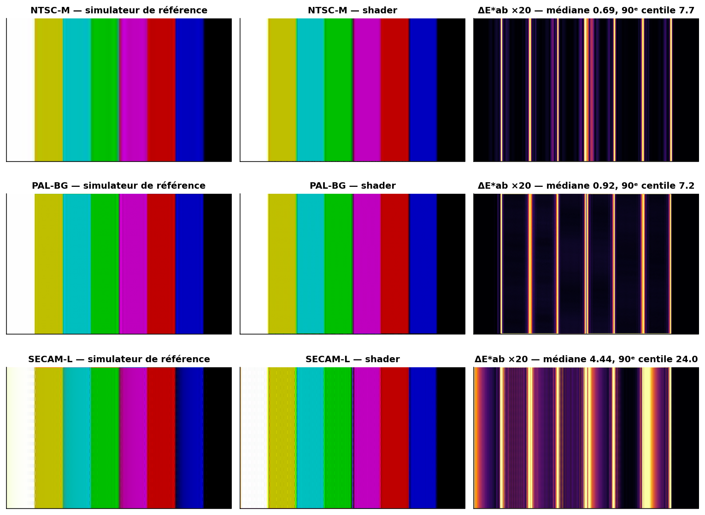

Trois normes, la même mire : à gauche la chaîne de référence, au milieu la
chaîne GPU, à droite l'écart colorimétrique amplifié vingt fois.

| norme | ΔE\*ab médian | 90ᵉ centile |
|---|---|---|
| NTSC-M | 0,69 | 7,7 |
| PAL-B/G | 0,92 | 7,2 |
| SECAM-L | 4,44 | 24,0 |

Un ΔE de 1 est le seuil de perception. Le NTSC et le PAL sont donc **sous le
seuil en médiane** : dans les aplats, les deux chaînes donnent la même couleur.
La carte de droite montre pourquoi — l'écart n'est pas réparti, il est
**concentré sur les transitions**. C'était prévisible : c'est là que la forme
exacte des filtres compte, et c'est précisément là que le shader approxime.

Le SECAM est plus loin, et pour deux raisons identifiées :

- **la désaccentuation basse fréquence n'est pas implémentée.** Le filtre
  normatif $A(f) = (1 + jf/f_1)/(1 + jf/3f_1)$, avec $f_1 = 85$ kHz, a son
  coude si bas qu'à 17,6 MHz d'échantillonnage il demanderait plus de deux
  cents coefficients — hors de portée du budget d'uniformes. Son effet est
  pourtant mesurable : il atténue de 7 dB dès 255 kHz. Sans lui, le
  discriminateur restituait les transitions avec un **dépassement de 0,26 en
  $U$** là où la référence n'en montre que 0,004, et ce dépassement dessinait
  une frange verte vive sur les contours — l'artefact le plus voyant du SECAM
  simulé, et il n'avait rien d'authentique. On en rend compte en resserrant la
  bande de démodulation à 0,85 MHz, valeur non pas déduite mais **mesurée** :
  on balaie la coupure et l'on garde celle qui minimise l'écart à la référence.
  Le dépassement retombe alors à 0,058, et la transition à 14 points contre 13 ;
- **le réjecteur est un filtre non récursif** là où la référence emploie un
  Butterworth récursif, hors de portée d'un shader.

Ces deux écarts sont documentés, bornés par un test, et **c'est là tout ce
qu'on peut honnêtement demander** à un portage : non pas qu'il soit identique,
mais qu'il diffère de façon connue et mesurée.

> **Vérifié par** — `tests/test_shaders.py::test_accord_avec_le_simulateur`,
> qui borne le ΔE médian à 1,5 pour le NTSC et le PAL, à 8 pour le SECAM.

### 12.10 Ce que cela coûte en temps

Mesuré par requête `GL_TIME_ELAPSED` — la seule façon honnête de chronométrer
un processeur graphique. L'horloge murale, elle, ment : l'appel de dessin rend
la main bien avant que le travail soit fait, et l'on peut « mesurer » ainsi
900 000 images par seconde.

Source 1920×1080, fenêtre 1440×1080, grille normative, qualité normale, sur une
RTX 3090 :

| configuration | travail GPU | image complète |
|---|---|---|
| NTSC-M, codage + décodage seuls | 0,11 ms | 0,48 ms |
| PAL-B/G, codage + décodage seuls | 0,14 ms | 0,49 ms |
| SECAM-L, codage + décodage seuls | 0,22 ms | 0,60 ms |
| PAL-B/G, tube complet et halo | 0,19 ms | 0,54 ms |
| SECAM-L, tube complet et halo | 0,28 ms | 0,65 ms |

La colonne « travail GPU » est ce que la carte passe réellement à calculer ; la
colonne « image complète » y ajoute le pilote, l'échange de tampons et la
boucle d'événements de Qt. Même la seconde tient entre 1 500 et 2 100 images
par seconde — de quoi lire une vidéo à 25 images par seconde en n'occupant
qu'un à deux pour cent du temps disponible.

L'effet de la qualité, à norme constante (PAL-B/G, travail GPU) :

| qualité | coefficients | travail GPU |
|---|---|---|
| rapide | 13 / 31 | 0,15 ms |
| normale | 21 / 41 | 0,18 ms |
| haute | 31 / 61 | 0,22 ms |

Le coût croît presque linéairement avec le nombre de coefficients, ce qui est
attendu : la boucle de filtrage domine, et chaque tour coûte une lecture de
texture.

**Le SECAM reste le plus cher des trois**, de bout en bout : treize passes au
lieu de deux, et un discriminateur qui lit $N+1$ échantillons par fragment
contre $N$. Le chapitre 9 l'avait annoncé pour des raisons de principe ; la
mesure le confirme en microsecondes. C'est peut-être la meilleure preuve que le
portage a gardé la physique intacte.

---

## 13. Le son : l'autre porteuse

Ce cours a parlé jusqu'ici d'un seul signal. Il y en avait deux.

Le son d'un téléviseur analogique ne voyage **pas** dans le signal vidéo. Il
occupe sa propre porteuse, quelques mégahertz plus haut dans le même canal
radio, et n'a de commun avec l'image que le canal — c'est-à-dire le bruit. De
cette cohabitation naît une des choses les mieux connues et les plus rarement
expliquées de la télévision hertzienne : **le son restait propre bien après que
l'image eut commencé à neiger.**

Sauf en France. Ce chapitre explique pourquoi.

### 13.1 Où se trouve le son

| | porteuse son | modulation | excursion | préaccentuation | puissance |
|---|---|---|---|---|---|
| NTSC-M | +4,5 MHz | FM | ±25 kHz | 75 µs | −10 dB |
| PAL-B/G | +5,5 MHz | FM | ±50 kHz | 50 µs | −13 dB |
| PAL-I | +6,0 MHz | FM | ±50 kHz | 50 µs | −10 dB |
| SECAM-D/K | +6,5 MHz | FM | ±50 kHz | 50 µs | −13 dB |
| **SECAM-L** | **+6,5 MHz** | **AM** | **taux 54 %** | **aucune** | **−10 dB** |

Le décalage n'est pas un détail de rangement : il détermine la largeur du
canal, et il a laissé une trace dans toute la vidéo moderne. La sous-porteuse
couleur du NTSC, à 3,58 MHz, bat avec la porteuse son à 4,5 MHz ; le battement
tombe à 920 kHz, en plein dans l'image. C'est pour l'éloigner qu'on a décalé
tout le système M d'un facteur 1000/1001 — et c'est de là que viennent les
29,97 images par seconde et le *timecode drop-frame*, qui empoisonnent encore
le montage vidéo soixante-dix ans plus tard.

L'excursion du système M ne fait que la moitié de celle de l'Europe, et ce
n'est pas un oubli : le canal américain fait 6 MHz là où le canal européen en
fait 7 ou 8. Il n'y avait pas la place. Nous verrons au §13.4 ce que cela coûte.

### 13.2 Le récepteur à intercarrier

Un récepteur pourrait démoduler la porteuse son directement. Presque aucun ne
le fait, et depuis les années 1950. Tous exploitent le **battement** entre les
deux porteuses, dont la fréquence est par construction leur différence.

L'astuce est superbe. La fréquence du battement ne dépend **plus du tout** de
l'oscillateur local : si celui-ci dérive, les deux porteuses dérivent
ensemble et leur différence ne bouge pas. Un poste à intercarrier reste calé
sur le son quel que soit son réglage d'image.

Elle a un prix, et on l'entend. Toute modulation de phase parasite de la
porteuse **image** se retrouve telle quelle sur le battement, et donc dans le
haut-parleur. Or le signal vidéo est bourré de composantes périodiques : les
impulsions de suppression, à 15 625 Hz pour la ligne et 50 Hz pour la trame.
D'où les deux défauts que tout le monde a entendus sans les nommer :

* le **sifflement de ligne**, à 15,6 kHz, que les enfants entendaient et les
  adultes plus tout à fait ;
* le **ronflement de trame**, à 50 Hz, qui n'est pas un ronflement de secteur
  mais un ronflement d'*image* — et qui **monte avec la luminosité**, puisque
  c'est la modulation de la porteuse image qui le fabrique. Un générique blanc
  faisait ronfler les postes mal réglés, un fondu au noir les faisait taire.

Le simulateur ne fabrique pas un bourdonnement « qui sonne juste » : il
construit les deux trains d'impulsions de suppression avec leurs **rapports
cycliques normatifs** — 19 % pour la ligne, 7,8 % pour la trame — et laisse les
harmoniques tomber où elles tombent. C'est ce qui fait la différence entre un
ronflement et un simple bourdon.

> **Dans le code** — `tvcolor.son.ChaineSon._ronflement`.

> **Vérifié par** — `tests/test_son.py::test_le_ronflement_porte_les_frequences_de_la_norme`,
> qui contrôle que toutes les raies fortes tombent sur le peigne de la
> fréquence **image** — et non de la fréquence trame, une trame comptant
> 312,5 lignes.

### 13.3 Un seul bruit, deux voies

C'est le point de départ de tout le reste. Le canal a une densité spectrale de
bruit $N_0$, et une seule. Ce que chaque voie en récolte ne dépend que de deux
choses :

$$\left(\frac{C}{N}\right)_{\text{son}} =
  \left(\frac{S}{B}\right)_{\text{image}}
  + 10\log_{10}\frac{B_{\text{image}}}{B_{\text{son}}}
  + P_{\text{porteuse}}$$

Le deuxième terme est un **gain**, et un gain considérable. La règle de Carson
donne la largeur occupée par la porteuse son :

$$B = 2\,(\Delta f + W) = 2\,(50 + 15) = 130\ \text{kHz}$$

soit 130 kHz contre cinq mégahertz pour l'image — **15,8 dB de bruit en moins,
par simple étroitesse**. Le troisième terme est une perte : la porteuse son est
émise dix à treize décibels sous l'image.

Le solde est positif de deux à six décibels. Le SECAM-L, dont la porteuse est
la plus étroite de toutes — pas d'excursion à loger, donc $B = 2W = 30$ kHz —
et la mieux servie en puissance, part **avec le meilleur rapport
porteuse/bruit des cinq systèmes**.

Retenez-le : il part gagnant.

### 13.4 Le gain de la démodulation, et l'exception française

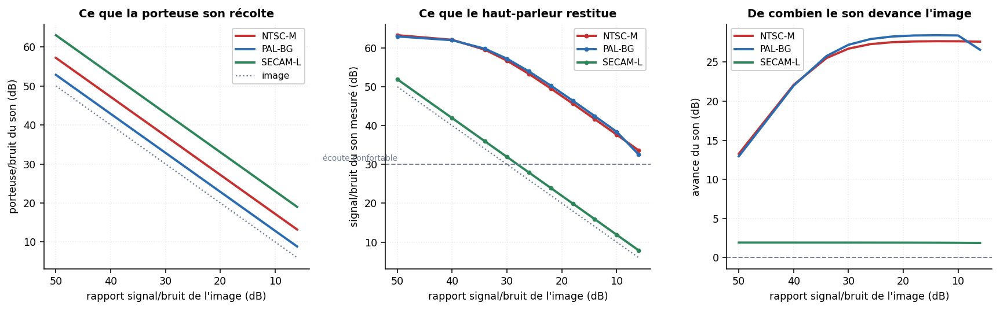

Les trois volets se lisent ensemble, et le troisième est la conclusion.

**À gauche**, ce que chaque porteuse récolte du même bruit : le SECAM-L est en
tête, comme annoncé. **Au milieu**, ce qui sort du haut-parleur : il est
dernier, et de vingt-cinq décibels. **À droite**, l'écart entre les deux — qui
n'est rien d'autre que le gain de la démodulation.

Pour la modulation de fréquence, avec $\beta = \Delta f / W$, la théorie donne

$$G = 3\,\beta^2\,(\beta + 1)$$

soit 21,6 dB en PAL ($\beta = 3{,}33$) et seulement 13,5 dB en NTSC
($\beta = 1{,}67$) — huit décibels de moins, pour la seule raison que le canal
américain était plus étroit et n'admettait que la moitié de l'excursion.

Pour la modulation d'amplitude, le gain est **zéro**. Non pas petit : nul, par
définition. Un détecteur d'enveloppe ignore la phase, ne moyenne rien, et
rectifie le bruit au lieu de le combattre.

Mesuré sur la chaîne, pour un rapport signal/bruit d'image de 30 dB :

| système | porteuse/bruit | signal/bruit du son | avance |
|---|---|---|---|
| NTSC-M | 37,2 dB | 56,7 dB | +26,7 dB |
| PAL-B/G | 32,9 dB | 57,2 dB | +27,2 dB |
| PAL-I | 36,3 dB | 59,5 dB | +29,5 dB |
| SECAM-D/K | 33,6 dB | 57,8 dB | +27,8 dB |
| **SECAM-L** | **43,0 dB** | **31,9 dB** | **+1,9 dB** |

Le meilleur rapport porteuse/bruit des cinq, et le pire son. Toute la
différence tient dans une ligne de code — l'une prend un **argument**, l'autre
un **module** :

```python
if voie.modulation == "AM":
    return (np.abs(z) - 1.0) / voie.taux_am          # détecteur d'enveloppe
avance = np.angle(z * np.conj(precedent))            # discriminateur
```

C'est, à l'échelle du son, exactement la même leçon que celle des chapitres 7
à 9 : ce n'est pas la qualité du signal reçu qui décide, c'est ce que le
démodulateur sait en faire.

> **Vérifié par** — `tests/test_son.py::test_le_son_du_systeme_l_est_bien_plus_fragile_que_celui_du_pal`,
> qui exige les deux à la fois : que le SECAM-L parte avec un meilleur
> porteuse/bruit, et qu'il arrive vingt décibels plus bas.

### 13.5 La préaccentuation

Le bruit d'un discriminateur de fréquence n'est pas blanc : il croît
linéairement avec la fréquence — il est **triangulaire**. Les aigus sortent
donc bien plus bruités que les graves, alors même qu'un programme musical y a
moins d'énergie.

D'où le remède, aussi vieux que la FM : relever les aigus à l'émission d'un
réseau $1 + j\omega\tau$, les rabaisser d'autant à la réception. Le signal est
rendu intact ; le bruit, lui, n'a subi que l'abaissement. Avec $\tau = 50$ µs,
le relèvement atteint **+13,7 dB à 15 kHz**.

Une subtilité d'implémentation vaut d'être signalée, parce qu'elle a failli
coûter cher. La courbe idéale $1 + j\omega\tau$ monte indéfiniment ; sa
transposition numérique directe place un pôle **exactement sur le cercle
unité**, à Nyquist, et la désaccentuation entre en résonance. Aucun réseau réel
ne monte indéfiniment — une résistance en parallèle borne la remontée — et l'on
modélise donc l'épaule :

$$H(s) = \frac{1 + s\tau}{1 + s\tau/K}, \qquad K = 2\pi \cdot 4W \cdot \tau$$

L'épaule à quatre fois la bande audio laisse la courbe se confondre avec la
théorie sur toute la bande utile — +13,4 dB mesurés à 15 kHz contre 13,7
idéaux — tout en gardant un filtre stable.

La désaccentuation est obtenue en **échangeant numérateur et dénominateur du
filtre numérique**, et non en transposant séparément l'inverse analogique : la
transformation bilinéaire étant une substitution appliquée aux deux à
l'identique, l'échange donne l'inverse *exact*. L'aller-retour rend le signal
à $3 \cdot 10^{-15}$ près, ce qu'un test vérifie — et il le faut, car une
chaîne qui colorerait le signal en l'absence de tout bruit rendrait sans valeur
toutes les mesures faites ensuite.

### 13.6 Le seuil, et les claquements

La modulation de fréquence a un défaut brutal : son avantage s'effondre d'un
coup. Tant que le vecteur reçu reste dominé par la porteuse, le bruit ne fait
que le faire trembler et le discriminateur mesure une phase à peu près juste.
Dès que le bruit devient comparable à la porteuse, il arrive que le vecteur
**fasse le tour de l'origine** : le discriminateur voit alors un saut de phase
entier, et produit une impulsion. C'est le claquement caractéristique d'une FM
en limite de réception.

Mesuré sur la chaîne, en PAL :

| porteuse/bruit | signal/bruit du son |
|---|---|
| 12,9 dB | 38,4 dB |
| 6,9 dB | 22,9 dB |
| 2,9 dB | 9,5 dB |

Six décibels de canal en coûtent quinze, puis treize. La chute est bien plus
raide qu'un décibel pour un décibel, et c'est la signature du seuil. Rien de
tout cela n'est programmé : les claquements sortent de `np.angle`, qui ne sait
rendre qu'une valeur entre $-\pi$ et $+\pi$.

### 13.7 Le bouton de volume, et où il se trouve

Le volume d'un téléviseur agit sur l'étage basse fréquence, **après** le
démodulateur. La place n'est pas un détail d'ingénierie : elle décide de ce que
le bouton peut et ne peut pas faire.

Il amplifie le bruit autant que le signal. Un poste mal reçu ne s'améliore pas
quand on monte le son, il devient seulement plus fort — ce que chacun a
vérifié. C'est aussi ce que vérifie un test : à 15 dB de rapport signal/bruit
d'image, douze décibels de gain laissent le rapport signal/bruit du son
rigoureusement inchangé.

Et il sature. Un étage de sortie poussé dans ses butées n'écrête pas carré : un
transistor y arrive progressivement. On modélise donc une courbe strictement
linéaire sous le seuil, puis une compression en tangente hyperbolique —
raccordée en valeur *et* en pente, la dérivée de $	anh$ en zéro valant un.
Mesuré :

| niveau de la source | +6 dB | +12 dB | +18 dB | +24 dB |
|---|---|---|---|---|
| 0,03 | +6,0 | +12,0 | +18,0 | +24,0 |
| 0,10 | +6,0 | +12,0 | +18,0 | +21,5 |
| 0,40 | +6,0 | +9,5 | +10,3 | +10,7 |
| 0,70 | +4,3 | +5,4 | +5,8 | +5,9 |

Une source silencieuse encaisse tout le gain sans la moindre distorsion ; une
source déjà forte n'en prend que ce qui reste de marge. C'est exactement le
comportement d'un amplificateur, et non celui d'un multiplicateur.

### 13.8 Où l'on remonte le niveau, et pourquoi ça change tout

Le son n'est pas toujours gravé au bon niveau, et la question se pose alors :
où le remonter ? La réponse n'est pas indifférente, et la chaîne le montre
sans ambiguïté.

Le simulateur offre deux gains. L'un est placé **avant** la modulation — c'est
le réglage du studio. L'autre est **après** la démodulation — c'est le bouton
de volume du poste. Mesuré sur une source gravée bas, amplitude 0,05, dans un
canal à 25 dB de rapport signal/bruit :

| gain appliqué | avant modulation | après démodulation |
|---|---|---|
| +0 dB | 33,5 dB | 33,5 dB |
| +6 dB | **39,6** | 33,5 |
| +12 dB | **45,6** | 33,5 |
| +18 dB | **51,4** | 33,5 |
| +24 dB | 51,9 | 33,5 |

Un décibel de gain avant modulation rend **un décibel de rapport
signal/bruit**. Un décibel après démodulation n'en rend aucun.

La raison est immédiate une fois posée : la modulation de fréquence code le
signal dans l'**excursion**, et le bruit du canal se traduit en une erreur de
fréquence qui, elle, ne dépend pas du signal. Sous-moduler, c'est donc laisser
inemployée une partie de l'excursion que la norme accorde — et le rapport entre
le signal et l'erreur de fréquence s'en ressent d'autant. Remonter le niveau
après le démodulateur remonte le bruit avec.

C'est pour cela qu'un diffuseur surveille sa modulation, et c'est ce qu'il faut
pousser quand la source est faible. Le plafond n'est pas loin : à +24 dB dans
l'essai ci-dessus l'excursion est pleine, le gain cesse de rendre quoi que ce
soit, et au-delà le limiteur de l'émetteur écrête — la distorsion passe de 0,05
à 15 %, exactement comme sur un émetteur réellement surmodulé.

> **Vérifié par** — `tests/test_son.py::test_le_gain_avant_modulation_ameliore_vraiment_le_rapport_signal_bruit`
> et son pendant `::test_le_gain_apres_demodulation_n_ameliore_rien`. Le second
> n'est pas un doublon : s'il échouait, c'est qu'un gain se serait glissé du
> mauvais côté du démodulateur.

### 13.9 Ce qui n'est pas simulé, et pourquoi

**La stéréophonie.** Le son de la télévision analogique, tel que décrit ici,
est monophonique. Le NICAM et le Zweiton sont venus dans les années 1980 et
ajoutent leurs propres porteuses — une porteuse numérique à 728 kbit/s pour le
premier, une seconde porteuse FM pour le second. Une entrée stéréo est donc
mélangée en mono, et **c'est une perte réelle**, pas un raccourci
d'implémentation.

**La porteuse à sa vraie fréquence.** Simuler une porteuse à 5,5 MHz pour y
loger quinze kilohertz de musique demanderait d'échantillonner à plus de onze
mégahertz — deux cent trente fois le taux du son. On travaille donc **en bande
de base complexe**, c'est-à-dire dans le repère qui tourne avec la porteuse.
Rien n'est perdu : la fréquence porteuse ne joue aucun rôle dans ce qui suit,
seules comptent l'excursion, la largeur de bande et la puissance. La grille de
travail vaut quatre fois la largeur de Carson, soit 528 kHz en PAL — et
quatre, pas deux, parce que la FM produit des raies latérales au-delà de
Carson, qui ne contient que 98 % de la puissance.

Le coût de la chaîne complète est de 2 à 8 % d'un cœur pour du temps réel, ce
qui laisse le lecteur vidéo parfaitement à l'aise.

> **Dans le code** — `tvcolor/son.py`. Le banc de mesure et le lecteur vidéo
> ont chacun un onglet **Son** qui donne accès à toute la chaîne, et le lecteur
> sait exporter en MP4 le résultat complet, image et son.

---

## 14. La cassette : ce qu'un magnétoscope fait au signal

Tout ce qui précède décrit un signal qui va de l'émetteur au téléviseur. Entre
les deux, pendant vingt-cinq ans, il y a eu un magnétoscope — et il ne s'est
pas contenté de transporter le signal, il l'a **démonté**.

C'est ce démontage, bien plus que le bruit de bande, qui donne au VHS son
aspect si reconnaissable qu'on l'identifie en une image.

### 14.1 Pourquoi le signal ne peut pas être enregistré tel quel

Deux obstacles, tous deux rédhibitoires.

**La bande passante.** Un signal composite occupe cinq mégahertz. La vitesse
relative entre la tête et la bande, dans un magnétoscope grand public, ne
permet guère d'en écrire plus de trois — et cela au prix d'une tête tournante,
d'un tambour incliné et d'un enregistrement en pistes obliques, déjà des
prouesses mécaniques.

**Le contact.** La tête et la bande ne se touchent pas d'une pression
constante : le contact fluctue énormément, et l'amplitude du signal lu avec
lui. Un enregistrement en **amplitude** donnerait une image dont la luminosité
papillonnerait au rythme du défilement. Insupportable.

D'où le procédé, qui tient en trois idées :

1. **séparer** luminance et chrominance dès l'entrée ;
2. **moduler la luminance en fréquence** — 3,8 à 4,8 MHz en PAL — puisque la
   modulation de fréquence se moque de l'amplitude ;
3. **transposer la chrominance sous elle**, autour de 627 kHz. D'où le nom du
   procédé, *color-under*.

### 14.2 Le prix de la place : la couleur du VHS

La transposition est faite pour de bon dans le simulateur — on multiplie par un
oscillateur local, on filtre, on remultiplie — parce que c'est de là que sort
la caractéristique la plus voyante du format.

La chrominance transposée ne dispose plus que d'environ **400 kHz**, contre
1,3 MHz à l'antenne. Sa définition horizontale tombe à :

$$N = 2 \times (400\,\text{kHz} \times 51{,}95\,\mu\text{s}) \times \tfrac{3}{4}
  \approx 31\ \text{lignes}$$

contre 240 lignes pour la luminance. **Un facteur huit.** Un aplat rouge sur
fond blanc ne bave pas un peu : il bave sur un huitième de la largeur utile.
C'est ce qu'on voit au premier coup d'œil sur la figure suivante, et c'est ce
qui trahit une cassette même quand tout le reste est propre.

La fréquence de transposition, 40,125 fois la fréquence ligne, n'est d'ailleurs
pas choisie au hasard : le quart de multiple joue exactement le rôle du
demi-multiple du chapitre 5. Il fait que le motif résiduel s'inverse d'une
ligne à la suivante au lieu de s'y superposer.

### 14.3 Ce qu'on voit, et ce qu'on mesure

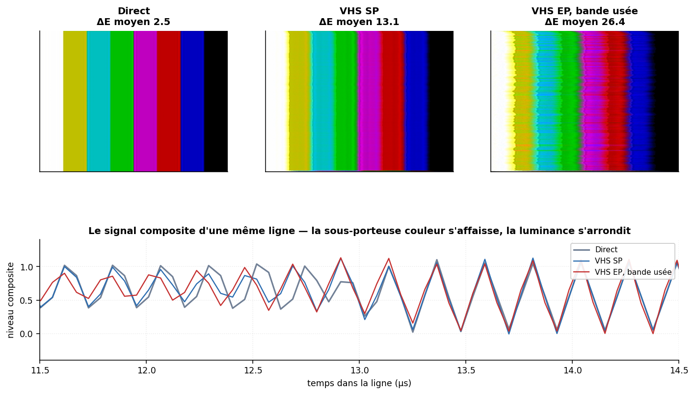

| | ΔE moyen | bande luma | bande chroma | définition chroma |
|---|---|---|---|---|
| direct | 2,5 | 5,0 MHz | 1,3 MHz | 100 lignes |
| VHS SP | 13,2 | 3,0 MHz | 0,40 MHz | 31 lignes |
| VHS LP | — | 2,6 MHz | 0,35 MHz | 27 lignes |
| VHS EP | — | 2,0 MHz | 0,29 MHz | 22 lignes |
| EP, 2ᵉ copie, bande usée | 26,8 | 1,7 MHz | 0,25 MHz | 19 lignes |

Le volet du bas de la figure est le plus instructif. C'est le signal composite
d'une même ligne, avant et après la cassette, sur une transition de couleur.
On y voit la sous-porteuse s'affaisser et la luminance s'arrondir — et l'on
comprend que la dégradation n'est pas un voile posé sur l'image, mais une
**altération de la forme d'onde elle-même**.

Au milieu d'un aplat, en revanche, les trois courbes se superposent presque :
la sous-porteuse y est stable et la cassette la restitue fidèlement. Tout se
joue aux transitions, là où la bande passante décide.

### 14.4 La mécanique

Aux limites de bande s'ajoutent les défauts d'un objet qui tourne et qui
frotte.

**La gigue de défilement.** La bande n'avance pas d'un mouvement parfait ; le
début de chaque ligne se décale de quelques dixièmes de microseconde, et **les
verticales ondulent**. C'est l'artefact le plus reconnaissable du format,
impossible à confondre avec autre chose.

Le décalage est *lissé verticalement* dans la simulation, et ce n'est pas un
raffinement : tiré indépendamment ligne à ligne il donnerait un grésillement de
haute fréquence — du bruit — alors qu'une mécanique a de l'inertie et produit
une ondulation lente.

**Et surtout, la gigue ne fait pas tourner la teinte.** Le point mérite qu'on
s'y arrête, parce qu'il a coûté deux fautes. Décaler le composite de deux
points d'échantillonnage, à $f_{sc} = f_e/4$, c'est tourner la sous-porteuse
d'un demi-tour : le magenta ressort vert. Un magnétoscope ne fait pas cela —
sa porteuse de relecture est **régénérée à partir du signal lu**, donc décalée
d'autant, et l'erreur s'annule dans la démodulation. C'est même toute la raison
d'être du color-under : les erreurs de base de temps s'éliminent d'elles-mêmes.

La gigue s'applique donc à l'**enveloppe** de la chrominance, jamais à sa
porteuse. Même remarque pour le retard de la voie couleur : 0,6 µs appliqués à
la porteuse modulée valent 238° à 4,43 MHz.

**La commutation des têtes.** Les deux têtes du tambour se relaient une fois
par trame, quelques lignes avant la fin de l'image active. Le relais n'est pas
instantané : ces lignes-là sont désynchronisées et bruitées. C'est la bande de
désordre en bas d'une cassette — que les téléviseurs masquaient en surbalayant,
et que les écrans plats d'aujourd'hui exposent sans pitié.

**Les pertes de signal.** L'oxyde manque par endroits, la tête ne lit rien.
Le magnétoscope comble avec la ligne précédente — c'est le rôle du
*dropout compensator* — mais l'escamotage se voit.

### 14.5 Le liseré des contours

Un dernier défaut, moins connu et pourtant omniprésent : le **liseré clair qui
borde les zones sombres**.

Il vient de la modulation de fréquence. Tout enregistreur à FM relève
fortement les hautes fréquences avant d'écrire et les rabaisse en lisant, pour
la même raison qu'au chapitre 13 — le bruit d'un discriminateur croît avec la
fréquence. Mais le relèvement est violent, une dizaine de décibels, et le
limiteur qui suit **écrête les crêtes qu'il fabrique** sur les contours francs.
La désaccentuation restitue alors un signal dont les dépassements ne se
compensent plus.

Sur un générique blanc sur noir, chaque lettre est bordée d'un halo clair.
Personne ne l'a jamais demandé ; tout le monde l'a vu.

### 14.6 Ce qui est simulé littéralement, et ce qui l'est par son effet

La règle du projet vaut ici comme ailleurs : ce qui n'est pas calculé doit être
dit.

**La transposition de la chrominance est faite pour de bon.** Il le fallait :
la perte de résolution et les erreurs de phase en sortent, et aucune des deux
ne se peint honnêtement.

**La modulation de fréquence de la luminance ne l'est pas.** Sa porteuse monte
à 4,8 MHz et ses bandes latérales dépasseraient Nyquist sur la grille du
simulateur — on mesurerait surtout du repliement. On en retient les trois
effets réels et mesurables : la limitation de bande, la préaccentuation avec
son dépassement, et le bruit qu'elle façonne. Le bruit est d'ailleurs ajouté
**avant** la désaccentuation, et non sur l'image finie : ajouté après il serait
blanc, et le grain d'une cassette ne l'est pas.

> **Dans le code** — `tvcolor/vhs.py`, inséré entre le canal et le décodeur
> dans `pipeline.encoder_decoder`. La place n'est pas arbitraire : on
> enregistre ce qui sort de l'antenne, et l'on rebranche la cassette sur la
> prise du téléviseur. Le magnétoscope hérite donc du bruit du canal et y
> ajoute le sien.

> **Vérifié par** — `tests/test_vhs.py`. Trois contresens physiques ont été
> trouvés par la mesure pendant l'écriture de ce module, et chacun y a laissé
> le test qui l'aurait attrapé.

### 14.7 Tous les chiffres, et d'où ils viennent

Aucune des valeurs qui suivent n'a été réglée à l'œil. Chacune se déduit soit
d'une spécification du format, soit d'une mesure faite sur la simulation. C'est
le seul moyen d'éviter le piège de ce genre d'exercice : produire quelque chose
de spectaculaire qui ne ressemble à rien de réel.

#### Les constantes du format

| grandeur | 625 lignes | 525 lignes | d'où elle vient |
|---|---|---|---|
| porteuse de chrominance transposée | 626 953 Hz | 629 371 Hz | $40{,}125\,f_H$ et $40\,f_H$ |
| porteuse de luminance, pointe de synchro | 3,8 MHz | 3,4 MHz | norme VHS |
| porteuse de luminance, blanc crête | 4,8 MHz | 4,4 MHz | norme VHS |
| retard de la voie couleur | 0,6 µs | 0,6 µs | mesuré sur matériel d'époque |

Le quart de multiple de la porteuse transposée joue exactement le rôle du
demi-multiple du chapitre 5 : il fait que le motif résiduel s'inverse d'une
ligne à la suivante au lieu de s'y superposer, et devient donc bien moins
visible.

#### Les bandes passantes, et la définition qui en découle

$$N_{\text{lignes}} = 2 \times \big(B \times T_{\text{active}}\big) \times \frac{3}{4}$$

La convention est celle des constructeurs : $N$ lignes signifient $N/2$
alternances sur une largeur égale à la **hauteur** de l'image, soit en 4:3
$(N/2)\cdot(4/3)$ alternances par largeur. Avec $T_{\text{active}} = 51{,}95$ µs :

| | bande luma | bande chroma | déf. luma | déf. chroma | rapport |
|---|---|---|---|---|---|
| signal reçu | 5,0 MHz | 1,3 MHz | 390 | 101 | 3,9 |
| **VHS SP** | 3,0 MHz | 0,40 MHz | 234 | **31** | **7,5** |
| VHS LP | 2,6 MHz | 0,35 MHz | 203 | 27 | 7,4 |
| VHS EP | 2,0 MHz | 0,29 MHz | 156 | 23 | 6,9 |

Le rapport de la dernière colonne est la caractéristique du format : **la
couleur du VHS est huit fois moins fine que sa luminance**, quand elle ne l'est
que quatre fois à l'antenne.

#### Les générations et l'usure

$$B_{\text{effective}} = B_0 \times 0{,}93^{\,g-1} \times (1 - 0{,}12\,u)$$

où $g$ est le numéro de génération et $u$ l'usure. Une racine par génération
plutôt qu'un produit brutal : deux filtres identiques mis en cascade ne
divisent pas la bande par deux, ils resserrent le flanc. Une troisième copie
d'une bande fatiguée tombe ainsi à 1,7 MHz de luminance et 245 kHz de couleur —
19 lignes de définition chromatique, où l'on ne distingue plus qu'un aplat par
huitième d'écran.

#### Les pertes de signal

C'est ici que le réglage à l'œil se paie, et l'on n'y a pas coupé.

Une bande VHS **neuve** est spécifiée à **dix ou vingt pertes par minute** —
soit une image sur trois cents. Une bande ordinaire en montre quelques-unes par
seconde. Une bande vraiment fatiguée, quelques-unes par image. La première
version du simulateur en produisait **cinq cents par seconde** au réglage par
défaut : mille cinq cents fois la spécification. Le résultat était spectaculaire
et faux ; personne n'a jamais vu une cassette faire cela.

L'échelle retenue est quadratique, pour que le bas du curseur reste discret et
le haut spectaculaire :

$$N_{\text{pertes/image}} = 3 \, a^2 \, (0{,}2 + 0{,}8\,u)$$

| réglage | par image | par seconde |
|---|---|---|
| défaut ($a = 0{,}25$, $u = 0{,}15$) | 0,06 | 1,5 |
| bande correcte ($0{,}4$ / $0{,}3$) | 0,21 | 5,3 |
| bande fatiguée ($0{,}7$ / $0{,}7$) | 1,12 | 27,9 |
| tout à fond | 3,00 | 75,0 |

#### La gigue de défilement

$$\delta = 0{,}30\ \mu\text{s} \times g \times (0{,}4 + 0{,}6\,u)
  \times \big(1 + 3 e^{-n/10}\big)$$

Le dernier facteur est le **drapeau** : les deux têtes du tambour se relaient
juste avant la fin de la trame, et au début de la suivante l'asservissement
n'est pas encore stabilisé. Les premières lignes sont donc franchement
décalées, et le bord supérieur de l'image se tord. C'est cette signature-là
qu'on reconnaît instantanément — elle permet de garder le reste de l'image très
calme, comme l'était un magnétoscope correct.

| réglage | milieu d'image | haut d'image |
|---|---|---|
| défaut | 0,9 échantillon | 3,7 |
| moyen | 2,0 | 8,2 |
| tout à fond | 5,3 | 21,3 |

Un échantillon vaut $1/921$ de ligne, soit 0,78 pixel sur une image de 720
points de large. Le réglage par défaut produit donc une ondulation inférieure
au pixel au milieu de l'image, et de trois pixels en haut.

#### Le bruit

| usure | luminance | chrominance |
|---|---|---|
| 0 (neuve) | 0,31 | 0,51 |
| 0,15 (défaut) | 0,42 | 0,70 |
| 0,50 | 0,69 | 1,15 |
| 1 (fatiguée) | 1,07 | 1,78 |

en niveaux sur 255. Le bruit de luminance est ajouté **avant** la
désaccentuation, et non sur l'image finie : ajouté après il serait blanc, et le
grain d'une cassette ne l'est pas.

#### Ce que tout cela coûte, mesuré

| | ΔE\*ab moyen | erreur de teinte |
|---|---|---|
| direct | 2,5 | +0,1° |
| VHS SP, réglages par défaut | 13,3 | +1,3° |
| EP, bande usée, 3ᵉ copie | 35,7 | −0,3° |

L'erreur de teinte reste nulle dans tous les cas, et c'est le contrôle le plus
important de ce chapitre : une cassette dégrade la couleur, elle ne la déplace
pas.

---

### 14.8 Le même magnétoscope, sur carte graphique

Le portage en GLSL suit la méthode du chapitre 12, et il a buté sur deux
choses que la version numpy ne pouvait pas rencontrer.

**Le filtre le plus étroit du projet.** L'enveloppe de chrominance tient dans
400 kHz sur une grille échantillonnée à 17,7 MHz : une coupure à 2,3 % de la
fréquence d'échantillonnage. Or la largeur de transition d'un noyau de $N$
coefficients vaut grossièrement $f_e/N$. À vingt et un coefficients — la
longueur de tous les autres filtres du lecteur — la transition mesure 844 kHz
et le « passe-bas à 400 kHz » n'existe tout simplement pas : la luminance fuit
massivement dans la couleur. Les noyaux du magnétoscope sont donc de 61 à 141
coefficients, les plus longs du projet.

Le défaut avait ceci de retors qu'il restait **invisible tant que la bande ne
bougeait pas**. La fuite, remodulée à la phase d'où elle venait, se réinsérait
exactement où elle était et ne coûtait rien. Dès qu'on ajoute la gigue, elle
est lue à une position et réinjectée à une autre : elle cesse de se compenser.

**Le décalage doit tomber sur un échantillon entier.** La texture du composite
est filtrée au plus proche — un signal échantillonné à quatre points par cycle
de sous-porteuse ne supporte pas l'interpolation linéaire, qui en modulerait
l'amplitude. Une lecture à une position fractionnaire retombe donc sur le texel
voisin, tandis que la phase de démodulation, elle, était calculée sur la
position exacte demandée. Les deux ne désignaient plus le même échantillon :

$$	ext{erreur de teinte} = 360° 	imes rac{f_{sc}}{f_e} 	imes \delta
  = 90° 	imes \delta$$

Un demi-échantillon d'écart vaut donc 45°, et la partie fractionnaire du
décalage changeant à chaque ligne, l'image se rayait de bandes horizontales aux
couleurs fausses. En arrondissant le décalage à l'échantillon, la lecture et la
phase désignent le même point. On y perd la finesse de l'ondulation — un
échantillon, soit un neuf-cent-vingtième de ligne — ce qui est de toute façon
plus fin que ce qu'un écran saura montrer.

**Un troisième piège : le générateur pseudo-aléatoire n'a pas la résolution.**

Les pertes de signal se testent, dans le shader, contre une probabilité. Avec
13 824 segments par image et 0,06 perte attendue, cette probabilité vaut
$4 \cdot 10^{-6}$. Or aucun générateur en flottants ne sait descendre là.

La raison n'est pas le sinus du classique `fract(sin(x) · 43758)`, contrairement
à ce qu'on croit souvent : c'est la **partie fractionnaire**. La résolution de
$	ext{fract}(y)$ vaut $y \cdot 2^{-24}$ — appliquée à un nombre de l'ordre de
43 000, elle plafonne à 0,0026 ; même sur un mélangeur soigné où le dernier
calcul reste de l'ordre de $10^4$, elle reste à $6 \cdot 10^{-4}$. Comparer
$4 \cdot 10^{-6}$ à un tirage qui ne sait produire que des multiples de
$6 \cdot 10^{-4}$ ne sélectionne plus une probabilité : le compte cessait
d'obéir au réglage, et l'image se retrouvait criblée de **six cents fois trop**
de pertes.

On renverse donc la question. Plutôt que « ce segment est-il perdu ? », on
demande « où sont les pertes de cette image ? » : quatre candidats, chacun tiré
avec une probabilité de l'ordre du dixième, et dont on tire ensuite la ligne et
le segment. Tous les seuils restent alors dans la plage où les flottants sont
fiables. Vérifié en instrumentant le shader pour qu'il rende son propre masque
de pertes : le compte obéit désormais au réglage sur deux décades.

**Un quatrième piège, et le plus sournois.** Les défauts d'une cassette
doivent changer à chaque image : une bande défile, le morceau de ruban sous la
tête n'est jamais le même. La passe s'appuyait pour cela sur l'avance de phase
de sous-porteuse d'une image à l'autre — la grandeur qui fait déjà ramper les
points. Or elle ne prend que **deux valeurs en NTSC, quatre en PAL, et une
seule en SECAM**, où la sous-porteuse est un multiple entier de la fréquence
ligne. Les défauts de la cassette restaient donc figés d'un bout à l'autre du
film, et en SECAM ils ne bougeaient jamais.

C'est le numéro d'image qui alimente désormais la graine. Et le comportement
qui en découle est juste jusqu'au bout : sur un arrêt sur image, le compteur
cesse d'avancer et le motif se fige — ce que fait un magnétoscope qui relit la
même piste en boucle.

**Le coût.** Mesuré par requête `GL_TIME_ELAPSED`, sur une RTX 3090 :

| | travail GPU |
|---|---|
| sans cassette | 0,20 ms |
| VHS SP | 0,36 ms |
| VHS EP | 0,45 ms |

Le magnétoscope double presque le temps de rendu — c'est la rançon de ses
noyaux longs — et l'on reste à plus de deux mille images par seconde.

> **Dans le code** — `shaders/vhs.glsl`, une passe entre le codage et le
> décodage. Le nombre de générations décide du nombre de passes : une copie de
> copie repasse réellement par toute la chaîne.

---

## 15. La caméra : la queue de comète

Tout ce qui précède part d'une image parfaite. Le codeur reçoit un R'G'B' idéal
et l'on mesure ce que la transmission lui fait. Dans les années soixante-dix
cette image sortait d'un **tube analyseur**, et le tube laissait sa signature
avant même que le codeur n'existe.

La plus voyante de ces signatures, tout le monde l'a vue sans forcément savoir
ce qu'elle était : dans une émission musicale en direct, les reflets sur les
cymbales, sur le chrome des pieds de micro, sur le vernis d'une guitare
laissaient de **grandes traînées blanches** quand ils se déplaçaient. Ce n'est
pas un flou de bougé, et ce n'est pas non plus de la rémanence ordinaire. Cela
s'appelle une **queue de comète**, et cela se déduit du fonctionnement du tube
en trois lignes de calcul.

### 15.1 Ce qu'un tube analyseur mesure vraiment

Une cible photoconductrice — de l'oxyde de plomb pour le Plumbicon de Philips,
qui équipait l'essentiel des cars de reportage européens — est portée à
quelques dizaines de volts par sa face avant, transparente. L'objectif y
projette l'image. Là où la lumière tombe, le photoconducteur devient conducteur
et la face arrière se **décharge** localement, proportionnellement à
l'éclairement et à la durée de pose.

Un faisceau d'électrons balaie ensuite cette face arrière et y redépose les
électrons manquants, ramenant chaque point au potentiel de la cathode.

> **Le courant qu'il faut au faisceau pour faire cela EST le signal vidéo.**

Il n'y a pas de conversion intermédiaire, pas de photodiode, pas de
convertisseur. On mesure directement la charge que l'image a soutirée. Cette
phrase est toute la physique du chapitre, et les deux défauts qui suivent en
découlent mécaniquement.

### 15.2 Premier défaut : le faisceau a un débit maximal

Le courant du faisceau est réglé en atelier pour évacuer le blanc de référence
avec une marge — environ 130 %. C'était un arbitrage d'exploitation, et non une
paresse : monter le courant grossit le spot et ramollit l'image. On donnait donc
au faisceau ce qu'il fallait pour un blanc un peu chaud, pas davantage.

Or un **reflet spéculaire** n'est pas un blanc un peu chaud. Une surface
diffuse ne renvoie jamais plus de lumière qu'elle n'en reçoit, et l'exposition
la place au blanc de référence. Un reflet, lui, est l'image de la source
elle-même : le filament d'un projecteur de deux kilowatts, vu dans du chrome
poli. Il dépasse le blanc de **vingt à cinquante fois**.

Le faisceau n'y peut rien. Il évacue sa tranche, toujours la même, et laisse le
reste. Il lui faut donc autant de trames que le rapport de dépassement :

$$N_{\text{trames}} = \frac{L}{c}$$

où $L$ est l'éclairement du reflet et $c$ la capacité du faisceau, tous deux en
blancs de référence. Pendant ces trames, le reflet s'est déplacé. La charge
restée en arrière se relit trame après trame — **au maximum que le faisceau
sait fournir**, c'est-à-dire au blanc écrêté.

*(Cette formule est incomplète, et le §15.3 dira pourquoi : la cible sature, et
$L$ y est plafonné. Elle suffit pour l'instant à comprendre le mécanisme.)*

Trois propriétés en découlent, et toutes trois se vérifient à l'œil sur un
enregistrement d'époque :

- la traînée est **d'un blanc plat**. Pas un dégradé : un aplat à 100 %,
  mesuré à 1,000 sur 89 % de sa longueur, et à 0,988 sur les cinq derniers
  pixels — le tout dernier pas du faisceau, qui rattrape enfin la charge
  restante. Un pour-cent : invisible ;
- **l'image disparaît derrière elle**. Le faisceau donnant déjà tout, ce qui
  s'ajoute à la cible ne se lit pas ;
- elle **s'arrête net**. Une décroissance exponentielle s'éteint en fondu ;
  celle-ci est arithmétique — une tranche fixe par trame — et se termine d'un
  pixel à l'autre.

C'est le troisième point qui trahit une queue de comète. Un flou de bougé, une
rémanence, une persistance d'écran : tout cela s'éteint doucement. Une comète a
un bout franc.

Une quatrième propriété s'ajoute, qu'on n'a pas cherchée : **la traînée change
de couleur sur sa longueur**. Une caméra a trois tubes, et un reflet de
projecteur à incandescence ne les charge pas également. Mesuré sur un reflet à
(1,00 ; 0,92 ; 0,74) :

| | tube rouge | tube vert | tube bleu |
|---|---|---|---|
| niveau dans le fichier | 1,000 | 0,981 | 0,950 |
| charge stockée | 10,0 (saturée) | 4,1 | 0,95 |
| longueur de traînée | 35 px | 24 px | 5 px |

La traînée sort donc blanche sur quelques pixels, **jaune ensuite, et rouge sur
la pointe**. Rien de tout cela n'est peint : c'est la même équation appliquée
trois fois, une par tube.
`tests/test_tube.py::test_la_trainee_change_de_couleur_sur_sa_longueur`.

**Mais il y faut un reflet dont les canaux ne soient pas tous écrêtés
ensemble**, et c'est une limite qu'il vaut mieux énoncer tout de suite : un
fichier où les trois canaux sont à 255 ne dit rien de leurs proportions réelles,
et la traînée y sort blanche. Le §15.6 y revient.

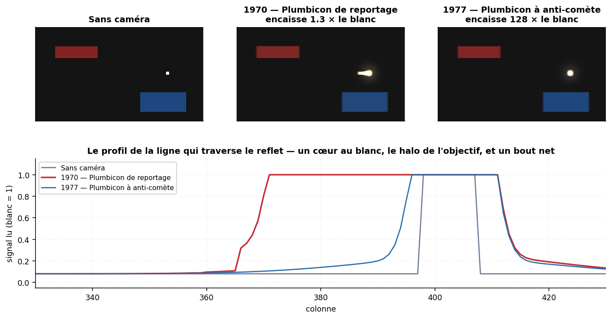

### 15.3 La cible sature, et c'est ce qui borne tout

Ce qui précède décrit une cible qui accumulerait indéfiniment. Elle ne le peut
pas, et l'oublier ruine tout le chapitre.

Le faisceau maintient la face arrière au potentiel de la cathode ; la lumière la
fait remonter vers celui de la face avant, et **elle ne peut pas aller plus
loin**. Une fois le point entièrement déchargé, l'éclairement supplémentaire ne
dépose plus rien. Il y a donc une charge maximale $q_{\max}$ :

$$q = \min\big(q_{\text{reste}} + L + b,\ q_{\max}\big)$$

La première version de ce simulateur n'avait pas cette borne, et le résultat
était spectaculairement faux. Mesuré : un reflet à vingt-cinq fois le blanc
**resté quarante trames dans le champ** — moins d'une seconde — avait accumulé
989 unités de charge, de quoi traîner **plus de quinze secondes** derrière lui.

| trames passées dans le champ | charge accumulée | traînée qui en résulte |
|---|---|---|
| 1 | 24,7 | 0,4 s |
| 5 | 123,6 | 1,9 s |
| 40 | 988,8 | 15,2 s |

Aucune caméra n'a jamais fait cela. C'est le genre de faute qui ne se voit pas
sur une mesure faite en trames — la traînée d'un reflet *qui passe* était
correcte — et qui saute aux yeux dès qu'on regarde une vidéo à la montre.

#### D'où vient $q_{\max}$

À un ordre de grandeur près, et pas davantage :

| grandeur | valeur d'exploitation |
|---|---|
| potentiel de la face avant | 45 V |
| courant de signal au blanc | 300 nA |
| capacité de la cible | 1,3 nF |
| durée d'une trame | 20 ms |

Le blanc de référence dépose $300\ \text{nA} \times 20\ \text{ms} = 6$ nC par
trame, soit $6\ \text{nC} / 1{,}3\ \text{nF} = 4{,}6$ V d'excursion ; et
$45 / 4{,}6 = 9{,}8$, soit une dizaine de blancs — mais les trois premières
valeurs sont des points de fonctionnement usuels et non des mesures, et
l'incertitude sur leur produit est large. **La durée observée des traînées est
un bien meilleur repère que ce produit**, et c'est elle qui a fixé la valeur
retenue de 6 : une comète de 3,6 trames, soit 72 millisecondes. C'est dit ainsi
plutôt que de faire passer une calibration pour une dérivation.

#### Deux conséquences qu'on n'attendait pas

**Un — au-delà de la saturation, un reflet plus brillant ne fait pas une traînée
plus longue.** Il ne peut pas déposer davantage que ce que la cible retient. La
durée ne dépend plus que du rapport entre cette capacité et le courant du
faisceau :

$$N_{\text{trames}} = \frac{q_{\max}}{c}$$

et non plus $L/c$. Un reflet à cinquante fois le blanc et un reflet à cent fois
donnent exactement la même traînée. C'est ce que vérifie
`tests/test_tube.py::test_un_reflet_plus_brillant_ne_traine_pas_plus_longtemps`.

**Deux — la traînée d'un reflet chaud est moins colorée qu'on ne l'attendait.**
Tous les canaux qui dépassent la saturation stockent la *même* charge, et leurs
traînées ont donc la même longueur ; seuls les canaux restés en dessous se
distinguent. Sur le reflet de projecteur du §15.2, mesuré en colonnes : le rouge
tient sur 53 pixels, le vert sur 42, et le bleu — qui ne surcharge pas du tout —
sur 5. La traînée est donc blanche sur une poignée de pixels, jaune sur les
quarante suivants, et rouge sur la pointe. Sans saturation, elle aurait été
rouge sur la moitié de sa longueur : le modèle fautif exagérait aussi la
couleur.

### 15.4 Second défaut : le faisceau ne décharge jamais tout à fait

Les électrons du faisceau arrivent avec une petite dispersion d'énergie. À
mesure que le potentiel de la cible se rapproche de celui de la cathode, il en
reste de moins en moins qui puissent atterrir : la décharge se termine en
traînant, et il subsiste une fraction $r$ de la charge.

C'est la **rémanence**, et elle a une propriété qu'il faut absolument
reproduire sous peine de tout fausser : **elle est bien pire dans les bas
niveaux.** Un petit écart de potentiel se résorbe lentement. On la modélise par

$$r(q) = r_{\max}\,\frac{q_0}{q + q_0}$$

où $q_0$ est le **genou** : la charge à laquelle la rémanence vaut la moitié de
son maximum. Il vaut 0,10 pour un Plumbicon, et c'est une propriété du tube au
même titre que $r_{\max}$ — le §15.12 montre que c'est même lui, et non
$r_{\max}$, qui sépare vraiment un tube d'un autre.

Cela donne, pour $r_{\max} = 0{,}35$ et $q_0 = 0{,}10$ — un Plumbicon — le
résidu suivant après extinction brutale de la lumière, en pour-cent du niveau
initial :

| niveau avant extinction | 1ʳᵉ trame | 2ᵉ | 3ᵉ | 4ᵉ |
|---|---|---|---|---|
| 100 % du blanc | 2,34 | 0,57 | 0,18 | 0,06 |
| 50 % | 4,30 | 1,08 | 0,34 | 0,12 |
| 20 % | 8,69 | 2,29 | 0,73 | 0,25 |
| 5 % | 18,83 | 5,57 | 1,84 | 0,63 |

La spécification d'un Plumbicon annonçait « moins de 3 % en troisième trame » ;
un vidicon au sulfure d'antimoine, celui des caméras de surveillance, dépassait
20 % et rendait tout mouvement illisible. La ligne du bas explique pourquoi les
plateaux étaient si violemment éclairés, et pourquoi les reportages tournés en
intérieur sombre traînaient tant.

**La lumière de biais** découle directement de ce tableau. Une petite lampe
éclaire la cible en permanence de quelques pour-cent du blanc, pour que le
point de fonctionnement ne descende jamais dans la région paresseuse. Elle ne
sert à rien d'autre. Mesuré sur un niveau à 5 % du blanc :

| lumière de biais | 1ʳᵉ trame | 2ᵉ | 3ᵉ |
|---|---|---|---|
| aucune | 18,8 | 5,6 | 1,8 |
| 2 % | 13,8 | 2,7 | 0,6 |
| 5 % | 9,5 | 1,2 | 0,2 |
| 10 % | 5,8 | 0,4 | 0,0 |

L'étage de niveau du noir de la caméra retire ensuite ce piédestal constant, si
bien que la lumière de biais ne coûte rien au contraste — seulement un peu de
bruit, que le simulateur ne modélise pas.

### 15.5 Les quatre lignes de calcul

Avec les charges exprimées en blancs de référence par trame :

$$\begin{aligned}
q &= \min\big( q_{\text{reste}} + L + b,\ q_{\max} \big) \\
s &= \min\Big( q\,\big(1 - r(q)\big),\ c \Big) \\
q_{\text{reste}} &\leftarrow q - s \\
\text{signal} &= s - b
\end{aligned}$$

Quatre lignes, et tout ce chapitre est dedans. Deux plafonds, et ils ne disent
pas la même chose : $q_{\max}$ est ce que la cible **retient**, $c$ ce que le
faisceau **évacue**. Le premier borne la longueur des traînées, le second leur
existence.

Et un contrôle qui vaut d'être écrit, parce qu'il garantit tout le reste. Sur
une scène **fixe** — donc sous saturation, une scène ordinaire ne dépassant pas
le blanc — le régime établi impose $q_{\text{reste}} = q\,r(q)$, donc

$$s = q - q_{\text{reste}} = L + b \qquad\Longrightarrow\qquad \text{signal} = L$$

**exactement**, et quelle que soit la rémanence. Un tube analyseur ne dégrade
pas une image immobile ; il ne fait que retarder les changements. Mesuré à
travers toute la chaîne, sur les barres de couleur en PAL : ΔE\*ab moyen de
2,51 sans caméra, et 2,51 avec. Pas 2,52. C'est le même critère que pour le
reste du simulateur — ce qui n'est pas un phénomène simulé doit passer sans
laisser de trace — et c'est ce que vérifie
`tests/test_tube.py::test_tube_transparent_sur_image_fixe`.

### 15.6 Rendre aux reflets leur éclairement

Il reste un obstacle, et c'est le seul endroit de ce chapitre où l'on suppose
quelque chose plutôt que de le calculer. **Un fichier huit bits a déjà été
écrêté** par celui qui l'a fabriqué : aucun pixel n'y dépasse le blanc. Sans
rien faire, la cible n'est jamais en surcharge et il n'y a pas la moindre queue
de comète.

Il faut donc rendre aux reflets l'éclairement qu'ils avaient. Le piège serait
de le faire sur le niveau seul : un drap blanc est écrêté lui aussi, et il
partirait en surcharge comme un éclat de chrome. Ce qui les sépare n'est pas
leur niveau — les deux sont à 100 % dans le fichier — mais **la part du
voisinage qui est écrêtée avec eux**. Un reflet occupe un centième de son
voisinage ; un drap, la moitié.

Sur un rayon de 3 % de la hauteur d'image :

| ce qu'on regarde | couverture | amplification |
|---|---|---|
| éclat de chrome, 4 pixels | 0,033 | × 1,00 |
| reflet filiforme sur une corde | 0,092 | × 0,98 |
| coin d'un aplat blanc | 0,324 | × 0,00 |
| bord d'un aplat blanc | 0,569 | × 0,00 |
| centre d'un aplat blanc | 1,000 | × 0,00 |

C'est bien une mesure de forme, et non de niveau : les cinq cas sont tous à
100 % dans le fichier.

#### Deux corrections, et une plage blanche de trop

Cette porte ne suffisait pas, et c'est une vraie vidéo qui l'a montré : de
**grandes plages blanches** apparaissaient un peu partout. Mesuré sur une image
exposée un tiers trop haut — ce que fait n'importe quelle caméra devant un
ciel — **4,90 % de l'image** partait en surcharge et traînait. On ne parle plus
de reflets : on parle d'un quart d'écran qui blanchit.

En cherchant *où*, la réponse était nette : 173 taches, de quinze pixels de
médiane, toutes avec une couverture de 0,125 — c'est-à-dire **en plein dans la
bande de transition de la porte**. Ce n'étaient pas des reflets spéculaires mais
des zones ordinaires que l'exposition avait écrêtées.

Deux choses n'allaient pas.

**Un — le seuil était trop bas.** À 0,75, un pixel aux trois quarts du blanc
était candidat. Un pixel aux trois quarts du blanc n'est pas un reflet
spéculaire : c'est un mur éclairé. Relevé à 0,94, avec un exposant porté de 3 à
5, seul ce qui est à un cheveu de l'écrêtage passe.

**Deux — et c'est la vraie faute — le même réglage servait aux deux usages.**
`seuil_reflets` décidait à la fois de ce qui est *candidat* et de ce qui *compte
comme voisinage clair*. Relever le seuil pour être plus sévère abaissait donc du
même coup la couverture mesurée partout, **ouvrait la porte**, et empirait les
choses. On l'a vu à la mesure avant de le comprendre : à 0,90 avec les deux
liés, la surcharge montait au lieu de descendre. Séparés, elle tombe.

| réglage | scène chaude | scène normale | vrais éclats gardés |
|---|---|---|---|
| 0,75 · exposant 3 (l'ancien) | 4,90 % | 0,22 % | 83 % |
| 0,90 · exposant 4 | 1,29 % | 0,03 % | 83 % |
| **0,94 · exposant 5** (retenu) | **0,94 %** | **0,03 %** | **83 %** |
| 0,98 · exposant 6 | 0,71 % | 0,02 % | 78 % |

Cinq fois moins de surcharge sur une scène chaude, sept fois moins sur une scène
normale, et l'on garde les mêmes quatre cinquièmes de vrais éclats spéculaires.
Le reste — les 0,7 % qui subsistent — est irréductible : ce sont des points
réellement écrêtés et réellement isolés, et rien dans le fichier ne dit s'ils
étaient du chrome ou une feuille de papier.

#### L'objectif, et le dégradé qui manquait

Cette porte ne suffisait toujours pas, et c'est une **capture d'émission de
1972** qui l'a montré : un groupe sur scène, éclairage de concert, mouvement
partout. Ce qu'on y voit est *léger*. Aucune plage blanche. Aucun pixel écrêté.
Les traînées visibles sont celles du sujet lui-même — un bras, une main — et
non des comètes.

Le simulateur, lui, produisait des **taches blanches à bords francs**, ce qui
n'existe nulle part. Deux choses manquaient, et la première est bête : il n'y
avait pas d'optique.

**Un reflet ne se pose pas sur la cible en carré net.** L'objectif l'étale —
diffraction, aberrations, et surtout la lumière parasite des huit à quinze
lentilles d'un zoom de reportage. Ce qui arrive sur la cible est une bosse
lisse. Sans cet étalement, l'éclairement reconstruit passait de 0,1 à 26 d'un
pixel au suivant :

| | profil de l'éclairement | pixels saturés | pixels qui traînent |
|---|---|---|---|
| sans optique | 0,1 → 26 → 0,1 | 36 | 36, tous de même durée |
| avec | 0,3 · 2,4 · 8,7 · 10,3 · 6,4 · 1,5 · 0,3 | 4 | 156, de durées échelonnées |

Le dégradé spatial et l'étalement des durées viennent tous deux de là. Et comme
l'énergie est conservée — c'est un étalement, pas une amplification — le sommet
retombe : un reflet marginal cesse de saturer, ce qui règle du même coup la
question de la force de l'effet.

**Une gaussienne seule ne suffit pas.** Elle retombe à rien en trois
écarts-types, et les flancs de la traînée restaient aussi francs qu'avant. La
lumière parasite d'un objectif, elle, décroît en raison inverse du carré de la
distance : elle s'étend sur toute l'image, et c'est elle qui fait le halo autour
d'une lampe dans un plan. On ajoute donc un **voile** — une seconde gaussienne
six fois plus large, portant 35 % de l'énergie. Deux gaussiennes ne font pas une
loi en $1/r^2$, mais elles en ont ce qui compte ici : un cœur étroit et une jupe
qui va loin.

Coupe verticale à travers un reflet, telle que la carte graphique la rend :

```
0,06  0,08  0,10  0,16  0,25  0,35  0,62  0,87  1,00 … 1,00  0,88  0,62  0,35  0,15  0,08  0,06
```

#### L'ordre compte, et l'inverse a coûté une transparence

La porte s'applique à la **source** de la lumière, et l'optique étale ensuite ce
que ce reflet émet. L'ordre inverse — étaler d'abord, fermer la porte ensuite —
paraît équivalent et ne l'est pas : l'excès d'une barre blanche, que la porte
rejetait pourtant en son centre, débordait sur la barre voisine où la porte
était ouverte. Mesuré sur une mire **immobile** : ΔE\*ab de 2,51 à 3,84, alors
que rien n'avait bougé.

D'où, sur carte graphique, une passe de plus : l'émission se calcule une fois,
avec ses seize points de couverture, et la diffusion n'a plus qu'à lire le
résultat.

#### Et huit satellites autour de chaque reflet

La diffusion, sur carte graphique, a d'abord été écrite comme la couverture :
une quadrature en couronnes de huit points. Ce qui marche pour un rayon de
quelques pixels ne marche pas du tout pour un voile de trente-cinq : chaque
reflet se retrouvait entouré de **huit copies de lui-même**, et une image
chargée de points brillants donnait des motifs blancs partout. Mesuré, sur un
cercle au rayon du voile : **973 % d'ondulation angulaire**, entre 0 et 0,12.

La bonne réponse était déjà dans la carte. **Une pyramide de mipmaps EST un flou
séparable**, calculé par le matériel, et l'échantillonner coûte une lecture au
lieu de seize. Un niveau de mipmap est cependant une moyenne de *boîte* : sa
réponse à un point est un carré, et un carré autour de chaque reflet se voit
aussi. Quatre prises décalées d'un demi-texel de ce niveau transforment la boîte
en **tente** — lisse, et presque ronde.

| | ondulation à 2 % du rayon | à 3 % | à 6 % | amplitude à 6 % |
|---|---|---|---|---|
| couronnes de huit points | — | — | 973 % | 0,1216 |
| mipmap, une prise | 164 % | 292 % | 71 % | 0,0055 |
| mipmap, tente à quatre prises | **26 %** | **66 %** | 145 % | **0,0054** |

L'artefact absolu est divisé par vingt-deux. Il reste une ondulation en
pour-cent aux grands rayons, mais sur une amplitude de cinq millièmes, où plus
rien ne se voit.

Une boîte de côté $L$ a l'écart-type $L/\sqrt{12}$, et les prises à un demi-texel
en ajoutent $L/2$ : les variances s'additionnent, et la tente vaut donc $0{,}577\,L$.
Le niveau de mipmap se déduit de là, et **il faut diviser le côté par deux** —
sans quoi la carte étale deux fois trop.

#### Ce que la capture de 1972 a fixé

La seconde chose qui manquait était plus simple encore : **l'hypothèse était
trop généreuse**. Supposer que tout pixel écrêté valait vingt-cinq fois le blanc
revient à supposer un projecteur dans l'axe partout. Calé sur la capture, le
réglage par défaut est descendu à **2,5 fois le blanc**. Sur un éclat de chrome
de douze pixels :

| éclat supposé | cœur blanc | halo dégradé |
|---|---|---|
| 25 × | 90 px | 111 px |
| 6 × | 72 px | 90 px |
| **2,5 ×** | **26 px** | **108 px** |
| 1,5 × | 12 px | 118 px |

À 2,5, le cœur fait deux fois le reflet au lieu de huit, et le halo domine.
Monter ce curseur, c'est supposer un projecteur dans l'axe — ce qui arrivait, et
donnait alors les comètes spectaculaires du §15.2. Mais ce n'était pas
l'ordinaire, et le simulateur ne doit pas le prendre pour tel.

#### Ce que la reconstruction ne peut pas savoir

Il faut le dire, parce que cela change une affirmation faite plus haut. Quand
les **trois canaux** sont à 255 dans le fichier, plus rien ne dit lequel était
le plus fort dans la scène : le simulateur les amplifie à l'identique, et la
traînée sort **blanche**. Le dégradé de couleur du §15.2 n'apparaît que si le
fichier a gardé l'inégalité — un reflet à (1,000 ; 0,981 ; 0,950), par exemple,
dont seul le rouge est vraiment écrêté.

L'information a été perdue par celui qui a fabriqué le fichier, pas par la
simulation. C'est la limite de tout ce chapitre, et elle est vérifiée dans les
deux sens par `tests/test_tube.py`.

### 15.7 Le filé de pose

Une dernière subtilité, qui a coûté un test raté avant d'être vue. Le
simulateur d'image fixe fabrique lui-même le mouvement : il translate la scène
de tant de pixels par trame. Si l'on se contente de la déposer à sa nouvelle
position, la charge saute d'un endroit à l'autre sans rien laisser entre les
deux, et **la traînée sort pointillée**.

La cible, elle, intègre pendant toute la durée de la trame : le reflet y balaie
un segment continu. Une moyenne glissante de la longueur du déplacement est
exactement cette intégrale, et c'est ce que fait `tvcolor.tube._filer`.

Sur carte graphique la question ne se pose pas de la même façon : le mouvement
vient de la vidéo, et le flou de bougé est celui de la caméra qui l'a tournée.
Une source de synthèse qui n'en aurait aucun donnerait une traînée pointillée —
c'est dit dans l'entête du shader plutôt que masqué.

### 15.8 Le circuit anti-comète, et pourquoi l'effet a disparu

Philips a livré l'ACT vers 1975-1976. Le principe est d'une simplicité
désarmante : **pendant la suppression ligne**, là où le signal n'est de toute
façon pas utilisé, le faisceau est défocalisé et son courant fortement
augmenté, le temps d'évacuer l'excès de charge. Le surcroît de bruit et la
perte de définition qui accompagnent un fort courant n'apparaissent donc jamais
dans l'image utile.

Le simulateur en fait une capacité supplémentaire, jusqu'à trois cent
quatre-vingt-onze fois le blanc — l'ordre de grandeur que les circuits réels
encaissaient. **La loi est quadratique**, et pas par coquetterie : étalée
linéairement jusque-là, l'échelle aurait fait passer le curseur de 1 à 391 en
ligne droite, et le premier cran aurait déjà supprimé toute traînée visible. Au
carré, la course entière sert à quelque chose.

| position du curseur | capacité | encaisse | traînée | en 625 lignes |
|---|---|---|---|---|
| 0,00 — aucun anti-comète | 1,3 | 1 × | 3,6 trames | 72 ms |
| 0,25 | 25,7 | 26 × | 0 | — |
| 0,40 | 63,7 | 64 × | 0 | — |
| 0,55 | 119,3 | 119 × | 0 | — |
| 0,75 | 220,7 | 221 × | 0 | — |
| 1,00 — ACT complet | 391,3 | 391 × | 0 | — |

La colonne des traînées bascule d'un coup, et c'est la saturation de la cible
qui le veut : dès que le faisceau évacue plus que les dix blancs que la cible
retient, il ne reste plus rien à traîner. Le premier cran suffit — ce qui
correspond bien à ce qu'on observe, l'anti-comète étant un dispositif qui
marchait ou ne marchait pas, et non un réglage qu'on dosait.

Soixante-douze millisecondes sans anti-comète : pour un objet qui traverse
l'écran en une seconde, cela fait **7 % de la largeur de l'image**. On comprend
que cela se soit vu. Et l'on comprend aussi pourquoi les traînées ont disparu
des émissions à la fin de la décennie sans que personne n'ait changé de tube.

Les autres réglages jouent comme on s'y attend — sauf un, et c'est celui qu'on
aurait cru le plus déterminant :

| ce qu'on change | traînée | en % de la largeur* |
|---|---|---|
| référence : reflet à 25 ×, faisceau 1,30 | 3,6 trames | 7 % |
| faisceau porté à 2,00 | 2,0 | 4 % |
| reflet à 50 × le blanc | 3,6 | 7 % |
| reflet à 100 × le blanc | 3,6 | 7 % |
| cible deux fois plus capacitive | 8,2 | 16 % |

\* pour un objet qui traverse l'écran en une seconde.

Les deux lignes du milieu ne sont pas une erreur de recopie : **l'éclat du
reflet ne change rien** au-delà de la saturation, et c'est le §15.3. Ce qui
allonge une traînée, c'est la capacité de la cible et la faiblesse du faisceau,
pas la brutalité du projecteur.

### 15.9 Le troisième défaut : trois tubes, trois déviations

Une caméra couleur en avait trois, un par primaire, derrière un prisme
séparateur. Leurs déviations devaient être réglées l'une sur l'autre au pixel
près ; le réglage tenait quelques heures puis dérivait avec la température.
D'où les **liserés colorés** sur les contours, nuls au centre de l'image et
croissants vers les bords — la signature d'une erreur d'échelle, qui était la
forme la plus courante du défaut.

Le simulateur la reproduit comme telle : le rouge est agrandi d'un facteur
$1 + \varepsilon$, le bleu réduit d'autant, le vert servant de référence. Trois
pixels d'écart au coin de l'image font passer le ΔE\*ab moyen des barres de
couleur de 2,51 à 3,47.

### 15.10 Ce que cela coûte, mesuré

| | ΔE\*ab moyen |
|---|---|
| sans caméra | 2,51 |
| caméra, scène fixe | 2,51 |
| caméra, filé de 6 pixels par trame | 4,08 |
| caméra, désalignement de 3 pixels | 3,47 |

Et la longueur de traînée, prédite puis mesurée sur une ligne du rendu :

| | valeur |
|---|---|
| prévue par le modèle (reflet à 25 ×, faisceau 1,30, 6 px/trame) | 22 px + 8 de reflet |
| mesurée sur le rendu | 37 px |
| part de la traînée exactement au blanc | 84 % |
| valeur du pixel qui suit la tête du reflet | 0,000 |

La prédiction est *plus courte* que la mesure, et l'écart s'explique en deux
termes plutôt que de se ranger sous la rubrique « à peu près ». La formule
$q_{\max}/c$ compte le plateau saturé, c'est-à-dire les trames où le faisceau
rend exactement son maximum. S'y ajoutent le filé de pose du §15.7, qui étale
le reflet du déplacement d'une trame — six pixels — et l'ultime trame où le
faisceau rattrape enfin la charge restante, en dessous de son maximum : ce sont
les cinq derniers pixels, à 0,988 au lieu de 1,000. Six plus cinq, plus la
largeur du reflet : le compte y est.

C'est ce que vérifie, à 25 % près,
`tests/test_tube.py::test_queue_de_comete_a_la_longueur_prevue`.

### 15.11 Sur carte graphique

Le tube est la **seule passe de ce moteur qui garde un état d'une image à
l'autre**. La charge résiduelle vit dans une texture, relue à l'image suivante,
et il en faut donc deux — on ne peut pas lire et écrire la même texture dans
une même passe. Deux programmes sont compilés depuis le même fichier : l'un
écrit la charge restante, l'autre le signal lu, et tous deux appellent la même
fonction `lire()`, parce que deux versions divergentes de cette formule
feraient dériver la traînée du résidu.

Deux pièges, découverts en mesurant plutôt qu'en regardant.

**L'ordre des deux passes.** Toutes deux lisent la charge que la trame
*précédente* a laissée. Le signal doit donc être lu **avant** que la charge ne
soit mise à jour. Dans l'autre ordre l'image sort à peu près juste — et la
traînée a une trame de moins que ce que le modèle prescrit, ce qui ne se voit
pas et fausse toute mesure.

**Le nombre de redessins.** Un redimensionnement de fenêtre, un mouvement de
curseur, un simple passage de souris redéclenchent le rendu. Si la cible se
déchargeait à chaque redessin, la longueur de la traînée dépendrait de la
fréquence de rafraîchissement au lieu de dépendre de la scène. La charge
n'avance donc que lorsqu'une image **réellement nouvelle** se présente, ce qui
suppose de compter les images reçues séparément du numéro d'image qui sert à la
phase de sous-porteuse — celui-ci n'avance pas quand l'animation est arrêtée.

S'y ajoute un amorçage : une cible fraîchement allouée est vide, et sa première
décharge serait incomplète. On lui fait donc poser vingt-quatre trames avant le
premier affichage. Une vraie caméra a le même défaut à l'allumage ; le
simulateur ne peut pas se le permettre sur une image arrêtée, où il n'y aura
jamais de trame suivante pour rattraper.

Enfin, la couverture du voisinage — le critère qui distingue un reflet d'un
drap blanc — est une intégrale gaussienne dans le simulateur de référence, et
une quadrature à seize points sur deux couronnes sur carte graphique, chaque
point étant lu dans un mipmap qui moyenne déjà sa part de l'image.

#### Une trame n'est pas une image

Une dernière faute, du même genre : invisible à la mesure, évidente à la montre.

Une cible se décharge **une fois par trame** — cinquante fois par seconde en 625
lignes, 59,94 en 525. Une vidéo, elle, arrive à sa propre cadence : 25 images
par seconde le plus souvent, 24 pour du cinéma, 30 pour une source américaine.
Une image de vidéo vaut donc **deux trames**, et le moteur temps réel qui
n'avançait la cible que d'une trame par image reçue faisait durer toutes les
traînées exactement deux fois trop longtemps.

La correction garde la partie fractionnaire d'une image à l'autre plutôt que de
l'arrondir à chaque fois — à 24 images par seconde il faut 2,083 trames par
image, et arrondir à 2 ferait dériver la durée de 4 %. Mesuré après correction,
sur la même scène et le même reflet :

| cadence de la source | images de traînée | durée |
|---|---|---|
| 24 im/s | 4 | 167 ms |
| 25 im/s | 4 | 160 ms |
| 30 im/s | 4 | 133 ms |
| 50 im/s | 7 | 140 ms |

La durée ne dépend plus de la cadence du fichier, ce qui est bien la moindre
des choses : la caméra qui a filmé la scène ne savait pas à quelle cadence on
allait la numériser.

Le coût mesuré des deux passes reste sous 0,06 ms, à la limite de ce que le
chronomètre GPU résout : devant les 0,3 à 0,4 ms du codage et du décodage, la
caméra ne se voit pas passer.

> **Dans le code** — `tvcolor/tube.py` pour la référence, `shaders/tube.glsl`
> pour la carte graphique, et l'onglet **Caméra** dans les deux outils. La
> caméra s'insère tout en amont, avant même la correction de gamma : c'est elle
> qui fabrique le signal que tout le reste transporte.

---

### 15.12 Sept caméras, et ce qui les sépare

Toutes les valeurs jusqu'ici décrivent *une* caméra. Or le matériel a beaucoup
changé entre 1966 et 1987, et c'est précisément ce qui rend la question
intéressante : la queue de comète n'est pas un défaut de la télévision, c'est le
défaut d'une génération de caméras.

#### Le correctif qu'il a fallu faire d'abord

En essayant de régler le simulateur sur un vidicon, on découvre qu'il en est
incapable. Le genou $q_0$ était écrit en dur à 0,10, et cette seule constante
figée plafonne le résidu de troisième trame aux alentours de 0,7 % **à niveau
nominal**, quelle que soit la rémanence :

| $r_{\max}$ | $q_0$ | résidu 3ᵉ trame @100 % | @20 % | @5 % |
|---|---|---|---|---|
| 0,20 | 0,06 | 0,03 % | 0,13 % | 0,33 % |
| 0,35 | 0,10 | 0,18 % | 0,73 % | 1,84 % |
| 0,50 | 0,30 | 0,98 % | 3,42 % | 7,11 % |
| 0,85 | 0,80 | 4,54 % | 14,26 % | 28,90 % |

La première colonne le dit : à genou constant, tripler la rémanence ne change
presque rien dans les hautes lumières, et tous les tubes finissent par se
ressembler. Or le genou est bel et bien une propriété du tube — il dit à quelle
échelle de charge le faisceau commence à peiner, ce qui dépend de l'épaisseur et
de la nature du photoconducteur. Le sortir en paramètre ouvre un facteur
vingt-cinq, et c'est lui, bien plus que $r_{\max}$, qui sépare un vidicon d'un
Plumbicon.

#### La table

| année | caméra | tube | encaisse | traînée | rémanence 3ᵉ | masquage |
|---|---|---|---|---|---|---|
| 1966 | Vidicon 3 tubes | vidicon Sb₂S₃ | 1 × | 2,0 trames — 41 ms | 28,90 % | 0,00 |
| 1970 | Plumbicon, car de reportage | PbO | 1 × | 1,7 — 34 ms | 1,84 % | 0,35 |
| 1973 | Plumbicon de studio, bien réglé | PbO | 1 × | 1,4 — 28 ms | 1,19 % | 0,55 |
| 1977 | Plumbicon à anti-comète | PbO + ACT | 128 × | 0 | 1,19 % | 0,70 |
| 1981 | Saticon d'ENG | Se-As-Te | 83 × | 0 | 5,34 % | 0,80 |
| 1984 | Saticon à canon diode | Se-As-Te | 272 × | 0 | 0,33 % | 0,95 |
| 1987 | CCD | — | 1 204 × | 0 | 0,00 % | 1,00 |

Traînée au réglage d'éclat **par défaut**, celui de la capture de 1972 ;
rémanence mesurée à 5 % du blanc et sans lumière de biais, qui est une propriété du tube et non du réglage
d'exploitation.

Les trois premières lignes se tiennent dans un mouchoir, et c'est encore la
saturation de la cible qui le veut : les trois tubes retiennent la même charge,
et seul le courant du faisceau les sépare. Ce qui distingue vraiment le vidicon
de 1966 n'est donc pas sa comète — treize millisecondes de plus, personne ne les
voit — mais sa **rémanence**, quinze fois pire, qui rendait tout mouvement
illisible. C'est d'ailleurs elle, et non la comète, qu'on voit sur les captures
d'époque.

Et la dernière colonne, celle du masquage, est celle qui a le plus bougé : c'est
la **colorimétrie** qui distingue le mieux ces caméras, bien avant leur comète.
Le §15.14 la chiffre — ΔE*ab moyen de 16,9 en 1966 contre 2,5 en 1987, et 37 %
de saturation en moins.

Deux choses à lire dans cette table. D'abord **la traînée ne remonte jamais** :
c'est une amélioration continue, et la bascule est nette en 1977, à l'arrivée de
l'anti-comète. Ensuite **la rémanence, elle, n'est pas monotone** — le Saticon de
1981 traîne davantage que le Plumbicon de 1973. Ce n'est pas une erreur de
saisie : le Saticon gagnait en définition ce qu'il perdait un peu en rémanence,
et son canon diode a réglé la question trois ans plus tard. Un simulateur qui
lisserait cet arbitrage mentirait sur l'histoire du matériel.

#### D'où viennent ces valeurs, exactement

Il faut le dire sans détour, parce que ce cours s'interdit précisément ce genre
de flou.

> **Ces valeurs ne sont pas recopiées de fiches techniques.** Ce qui est
> documenté, c'est le *comportement* de chaque génération : quel
> photoconducteur, quelle classe de rémanence, la présence ou l'absence d'un
> circuit anti-comète, la pratique d'alignement de l'époque. Les paramètres du
> simulateur sont choisis pour **reproduire ce comportement**, et chaque entrée
> de la table porte sa rémanence mesurée — que
> `tests/test_tube.py::test_chaque_camera_a_la_remanence_annoncee` recalcule à
> chaque exécution, de sorte qu'une valeur retouchée à l'œil fait rougir la
> suite.

Ce qui sert d'ancrage documentaire, et rien de plus : le Plumbicon de Philips
(1963) était spécifié à moins de 3 % de résidu en troisième trame, et ce fut son
argument de vente face au vidicon au sulfure d'antimoine, qui dépassait 20 % et
rendait tout mouvement illisible. Philips a livré le circuit anti-comète vers
1975-76. Le Saticon de Hitachi et de la NHK (1973) gagnait en définition ce
qu'il perdait en rémanence, et son canon diode du début des années 80 a réglé la
question. L'alignement automatique des trois tubes est apparu vers 1980.

On remarquera qu'**aucun nom de produit n'apparaît** dans les libellés, ni
LDK-25, ni HL-79. Attribuer nommément des paramètres inventés à un modèle réel
serait exactement l'affirmation invérifiable que ce projet s'interdit ; le type
de tube et l'époque suffisent à situer le matériel.

#### Ce que la dernière ligne ne simule pas

L'entrée CCD de 1987 met tout à zéro : ni rémanence, ni queue de comète, ni
désalignement, puisqu'il n'y a plus ni cible photoconductrice, ni faisceau, ni
trois tubes à superposer. Elle est là pour montrer **ce qui a tué le
phénomène**, et non pour simuler un capteur à transfert de charge : le défaut
propre au CCD — la colonne verticale de lumière qui traverse toute l'image sur
une très haute lumière, par fuite dans le registre de transfert — n'est pas
modélisé ici. C'est un tout autre mécanisme, qui mériterait son propre chapitre.

> **Dans le code** — `tvcolor.tube.CAMERAS`, une table unique dont l'interface,
> le cours et les tests tirent tous leurs valeurs, sur le modèle exact de
> `tvcolor.constantes.NORMES`. `ModeleCamera.appliquer` ne pose que les
> caractéristiques du matériel : l'éclat des reflets décrit le plateau filmé et
> non la caméra, et deux caméras différentes braquées sur les mêmes cymbales y
> voient les mêmes reflets.

---

### 15.13 Le pont temporel, ou ce que la source ne contient plus

La cible intègre **en continu** pendant toute la trame : un reflet qui la
traverse y balaie un segment. Une vidéo, elle, n'a que vingt-cinq images par
seconde. Ce qui s'est passé entre deux images **n'est pas dans le fichier**, et
la charge se dépose donc par paquets espacés.

Le résultat se voit tout de suite, et c'est faux : au lieu d'une traînée, on
obtient **un chapelet de reflets distincts**. Mesuré sur la carte graphique, un
reflet de trois pixels avançant de douze par image :

| | pixels allumés | étendue | continuité |
|---|---|---|---|
| sans pont | 45 | 207 | 22 % |
| avec pont | 213 | 236 | 90 % |

Quatre pixels allumés sur cinq manquaient. L'outil image fixe n'a pas ce
problème — il fabrique le mouvement, donc il le connaît, et `_filer` étale
l'éclairement exactement de la longueur voulue (§15.7). Le moteur temps réel,
lui, reçoit une vidéo dont il ignore tout du mouvement.

#### Le principe : constater plutôt que chercher

On n'estime pas le mouvement — ce serait une usine à gaz, et fragile. On
constate son **résultat** : un point situé entre un reflet présent et une trace
passée a nécessairement été traversé. Sur huit directions :

$$\text{pont}(x) = \max_{d}\ \min\Big(\max_{+d} \text{« reflet neuf »},\ \max_{-d} \text{« trace abandonnée »}\Big)$$

Les deux qualificatifs font tout le travail, et la première version s'en
passait — pour ce résultat : **deux reflets immobiles distants de vingt-quatre
pixels se retrouvaient reliés par un trait blanc**, purement inventé. On exige
donc

- « neuf » : un reflet **ici**, qui n'était pas là à l'image d'avant ;
- « abandonné » : un reflet qui était **là**, et qui n'y est plus.

Un reflet immobile est dans les deux images au même endroit : les facteurs
s'annulent, et rien n'est relié. Un reflet qui a bougé a l'un d'un côté et
l'autre de l'autre : le segment se remplit. Les deux cas sont vérifiés en sens
contraire par `tests/test_tube.py`.

#### La faute qui a mangé l'image

La formulation ci-dessus est la seconde. La première comparait l'éclairement à
la **charge** : « de l'éclairement là où il n'y avait pas encore de charge, et
de la charge là où il n'y a plus d'éclairement ». Elle marchait parfaitement sur
un reflet isolé, et se comportait très mal sur une vraie image.

Le défaut est une boucle, et il faut une seconde pour le voir une fois qu'on
l'a vu : **un point comblé dépose lui aussi de la charge.** À l'image suivante
il devient donc une « trace abandonnée » pour ses voisins, qui se comblent à
leur tour, et ainsi de suite. Mesuré sur une scène chaude en mouvement — un ciel
écrêté et quelques éclats spéculaires :

| image | 1 | 2 | 3 | 5 | 10 |
|---|---|---|---|---|---|
| part de l'écran en blanc saturé | 23 % | 32 % | 61 % | 78 % | **85 %** |

La tache mangeait l'image. Et amortir ne suffisait pas : en ne donnant à un
point comblé que 55 % de ce qu'un dépôt réel lui aurait donné, on atteignait
encore 61 % à la douzième image. Il fallait **couper la boucle, pas la
freiner**.

D'où la formulation retenue : le pont ne consulte QUE l'éclairement — celui-ci
et celui de l'image précédente — et **jamais la charge**. Un point comblé
n'entre dans aucune des deux textures qu'il lit, et ne peut donc plus rien
déclencher. Sur la même scène, la part de blanc se stabilise à 27 % dès la
deuxième image et n'en bouge plus.

C'est aussi ce qui a imposé au pont d'avoir **sa propre passe** sur carte
graphique. Tant qu'il vivait dans la passe d'éclairement, il ne pouvait pas
relire celui-ci — et recalculait donc l'éclairement de ses sondages *sans la
porte de couverture*, trop coûteuse à refaire cent vingt-huit fois. Un grand
aplat écrêté comptait alors comme un reflet neuf, ce qui alimentait la même
boucle par un autre chemin.

Un troisième garde-fou s'est imposé à la mesure : **seul ce qui dépasse le blanc
compte**, des deux côtés. Sans ce seuil, le pont fuyait sur n'importe quelle
image — un pixel sombre voyait un voisin clair d'un côté, le résidu de rémanence
d'un autre voisin de l'autre, et se trouvait relevé de trois millièmes. Trois
millièmes suffisaient à ruiner la transparence sur scène fixe, qui est le
contrôle dont tout le reste dépend. Une queue de comète est par définition un
dépôt en surcharge ; rien d'autre n'a le droit de déclencher le pont.

#### Ce que c'est, et ce que ce n'est pas

C'est une **interpolation**, pas un phénomène. Elle reconstruit une information
que la source ne contient plus, et il faut le dire plutôt que de la faire passer
pour de la physique.

**Elle est donc nulle par défaut.** Sur un reflet isolé elle fait exactement ce
qu'on lui demande ; sur une image chargée, elle diverge du simulateur de
référence — 41 % de blanc saturé contre 29 % sur une scène chaude en mouvement.
La raison est mesurée : la tache de diffusion de la carte graphique est 23 %
plus large que la gaussienne exacte, et le pont amplifie cet écart le long de ses
huit directions. On ne l'allume donc que pour ce à quoi il sert — un reflet vif
et rapide qui sortirait en chapelet — et le reste du temps il coûte plus qu'il
ne rend.

Sur carte graphique, cela a imposé de **découper la caméra en quatre passes**
au lieu de deux. La reconstruction de l'éclairement et le pont coûtent seize points
de couverture et jusqu'à cent vingt-huit sondages ; les recalculer dans la passe
de signal *et* dans la passe de charge aurait doublé la note. Ils ont donc leur
propre passe, dont le résultat vit dans une texture que les deux autres se
contentent de lire — deux texels chacune. Le découpage est à la fois plus rapide
et plus sûr : il n'y a plus qu'un seul endroit où la reconstruction est écrite.

### 15.14 La colorimétrie de la caméra

Reste une erreur dont on n'a pas encore parlé, et qui n'a rien à voir avec la
cible : **une caméra à tubes ne voit pas les bonnes couleurs.**

#### Pourquoi il y a forcément une erreur

Les courbes d'analyse idéales d'une caméra sont les fonctions colorimétriques
des primaires de restitution — celles du chapitre 2. Or ces fonctions ont des
**lobes négatifs**, et aucun filtre ne sait soustraire de la lumière. On ne
fabrique que des courbes tout-positives, qui les approchent. Chaque voie récolte
donc une part de ses voisines, et l'image sort **désaturée**.

Le simulateur modélise cette contamination par une matrice appliquée en lumière
linéaire, **avant la cible** — c'est le prisme séparateur qui la porte, pas
l'électronique :

$$A = \begin{pmatrix}
0{,}88 & 0{,}10 & 0{,}02 \\
0{,}08 & 0{,}86 & 0{,}06 \\
0{,}02 & 0{,}10 & 0{,}88
\end{pmatrix}$$

Les lignes somment à 1, et ce n'est pas un détail : **le blanc reste blanc**.
L'erreur ne porte que sur la saturation, et marginalement sur la teinte.

Ces six coefficients ne viennent pas d'une fiche technique, et il faut le dire :
ils sont choisis pour reproduire le comportement documenté — une désaturation
nette, plus marquée sur le vert et le cyan, le bleu étant le mieux séparé parce
que son filtre est le plus étroit. C'est leur effet, chiffré ci-dessous, qui
engage ; pas les coefficients.

#### La matrice de masquage

D'où le second étage, dans l'électronique de la caméra : une matrice 3 × 3 aux
coefficients hors diagonale **négatifs**. Elle refabrique par soustraction
électronique les lobes que l'optique ne pouvait pas faire. À pleine efficacité
elle est l'inverse exacte de $A$ ; le simulateur interpole entre l'identité —
pas de matrice du tout — et $A^{-1}$.

Elle vient **après la cible**, et l'ordre compte : entre les deux il y a
l'écrêteur de blanc, et la correction ne rattrape donc pas ce qu'il a coupé.

Mesuré sur les barres de couleur en PAL :

| masquage | ΔE\*ab moyen | saturation |
|---|---|---|
| sans caméra du tout | 2,51 | −1,5 % |
| 0,00 — aucune matrice | 16,90 | −36,9 % |
| 0,35 | 11,90 | −29,2 % |
| 0,55 | 8,93 | −23,8 % |
| 0,70 | 6,66 | −18,9 % |
| 0,80 | 5,16 | −14,9 % |
| 0,95 | 3,02 | −6,1 % |
| 1,00 — matrice exacte | 2,51 | −1,5 % |

La dernière ligne est le contrôle : à masquage parfait, la caméra redevient
**exactement** transparente, au chiffre près.

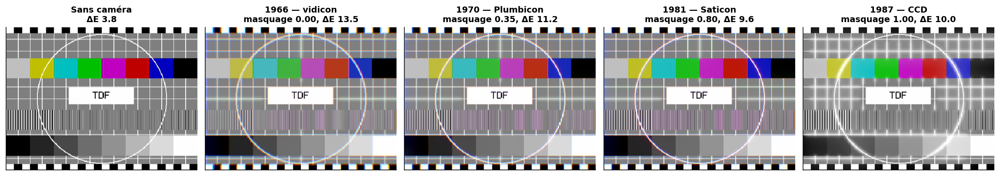

La figure le montre sur la mire française du §15.12 : les barres du vidicon de
1966 sont délavées et ses contours bordés de liserés colorés, celles du CCD de
1987 sont celles de la mire — au dixième de ΔE près. C'est le même critère que partout
ailleurs dans ce cours.

Et c'est le réglage qui a le plus progressé entre 1966 et 1987 — bien plus que
la rémanence. Une caméra industrielle de 1966 n'avait pas de matrice du tout et
rendait une image franchement délavée ; en 1984 elle était réglable voie par
voie, et la colorimétrie était juste.

#### Deux limites de précision, rencontrées en route

La première est arithmétique et vaut d'être notée. L'aller-retour $A$ puis
$A^{-1}$ laisse un résidu de $10^{-16}$ sur les canaux qui devraient être
exactement nuls. La correction de gamma qui suit a une **pente infinie en
zéro** : elle transforme ce $10^{-16}$ en $2 \cdot 10^{-6}$ sur l'image finale.
C'est la limite de ce qu'on peut demander à une transparence quand une matrice
traverse un exposant fractionnaire — et cela reste quatre mille fois plus petit
qu'un échelon de huit bits.

La seconde a coûté une demi-heure de recherche. Sur carte graphique, la même
reconstruction procède par **soustraction**, et les erreurs relatives d'un demi-
flottant — dérisoires prises une à une — s'y amplifient : quatre niveaux sur 255
au milieu d'une barre de couleur, ce qui n'est plus un détail. Les textures de
charge et d'éclairement sont donc passées en simple précision. L'écart est
retombé sous le niveau de quantification.

---

## 16. Annexes

### A. Tableau des constantes

| | NTSC-M | PAL-B/G | SECAM-L |
|---|---|---|---|
| Norme UIT-R | BT.470-M | BT.470-B/G | BT.470-L |
| Lignes totales / actives | 525 / 480 | 625 / 576 | 625 / 576 |
| Trames par seconde | 59,940 059… | 50 | 50 |
| Fréquence ligne $f_H$ | 15 734,264 Hz | 15 625 Hz | 15 625 Hz |
| Durée de ligne active | 52,6 µs | 51,95 µs | 51,95 µs |
| Sous-porteuse | 3,579 545 MHz = $\frac{455}{2} f_H$ | 4,433 618 75 MHz = $(\frac{1135}{4} + \frac{1}{625}) f_H$ | $f_{OB}$ 4,250 MHz = $272 f_H$ <br> $f_{OR}$ 4,406 25 MHz = $282 f_H$ |
| Rotation par ligne | 180,000° | 270,576° | 0° |
| Bande luminance | 4,2 MHz | 5,0 MHz | 6,0 MHz |
| Bande chrominance | $I$ 1,3 / $Q$ 0,4 MHz | $U$, $V$ 1,3 MHz | ≈ 1,5 MHz |
| Modulation | QAM sur $I$/$Q$ | QAM, $V$ alterné | FM séquentielle |
| Piédestal | 7,5 IRE (0 au Japon) | 0 | 0 |
| Burst | 9 cycles à 180° | 10 cycles à 135°/225° | identification en suppression |
| Primaires | SMPTE-C (1953 à l'origine) | EBU | EBU |
| Gamma supposé | 2,2 | 2,8 | 2,8 |

**Matrices de matriçage** (composantes gamma-corrigées) :

$$
\begin{pmatrix} Y' \\ U \\ V \end{pmatrix} =
\begin{pmatrix}
0{,}299 & 0{,}587 & 0{,}114 \\
-0{,}147 & -0{,}289 & 0{,}436 \\
0{,}615 & -0{,}515 & -0{,}100
\end{pmatrix}
\begin{pmatrix} R' \\ G' \\ B' \end{pmatrix}
$$

$$
\begin{pmatrix} Y' \\ I \\ Q \end{pmatrix} =
\begin{pmatrix}
0{,}299 & 0{,}587 & 0{,}114 \\
0{,}596 & -0{,}274 & -0{,}322 \\
0{,}211 & -0{,}523 & 0{,}312
\end{pmatrix}
\begin{pmatrix} R' \\ G' \\ B' \end{pmatrix}
$$

$$
\begin{pmatrix} Y' \\ D'_R \\ D'_B \end{pmatrix} =
\begin{pmatrix}
0{,}299 & 0{,}587 & 0{,}114 \\
-1{,}333 & 1{,}116 & 0{,}217 \\
-0{,}450 & -0{,}883 & 1{,}333
\end{pmatrix}
\begin{pmatrix} R' \\ G' \\ B' \end{pmatrix}
$$

Inverses :

$$
\begin{aligned}
R' &= Y' + 1{,}140\,V \\
G' &= Y' - 0{,}395\,U - 0{,}581\,V \\
B' &= Y' + 2{,}032\,U
\end{aligned}
\qquad\qquad
\begin{aligned}
R' &= Y' + 0{,}956\,I + 0{,}621\,Q \\
G' &= Y' - 0{,}272\,I - 0{,}647\,Q \\
B' &= Y' - 1{,}106\,I + 1{,}703\,Q
\end{aligned}
$$

> **Vérifié par** — `tests/test_matrices.py`, qui compare chacune de ces
> matrices aux valeurs publiées.

### B. Pourquoi la France a choisi le SECAM

Trois raisons, qu'il serait malhonnête de réduire à une seule.

**Technique.** Le SECAM est objectivement meilleur sur les longues liaisons
hertziennes à bonds multiples, où les erreurs de phase s'accumulent. Le réseau
français, dense en réémetteurs et servant un territoire au relief accidenté,
était précisément le cas d'usage le plus favorable. Le SECAM supporte aussi
mieux la transmission par câble long et les enregistreurs à bande de l'époque.

**Industrielle.** Henri de France et la Compagnie française de télévision
détenaient les brevets. Adopter le PAL, c'était payer des royalties à
Telefunken et laisser l'industrie allemande équiper le marché français.

**Politique.** L'adoption d'un standard national s'inscrivait dans la politique
d'indépendance technologique de la France gaullienne, au même titre que la
force de dissuasion ou le Concorde. Le choix du SECAM par l'URSS et le bloc de
l'Est en 1967, puis par une grande partie de l'Afrique francophone et du
Moyen-Orient, en a fait un instrument d'influence autant qu'une norme technique.

Les trois raisons sont vraies simultanément. Prétendre que le SECAM était
techniquement injustifié est faux ; prétendre que la technique seule a décidé
l'est tout autant.

### C. MESECAM

Au Moyen-Orient, les magnétoscopes VHS destinés au SECAM n'utilisaient pas la
méthode française. Un magnétoscope ne peut pas enregistrer la sous-porteuse
telle quelle : il la transpose vers le bas (*color under*). Les magnétoscopes
français transcodaient réellement le SECAM ; les magnétoscopes MESECAM se
contentaient de translater la bande de chrominance, comme pour du PAL.

Résultat : les deux méthodes sont **incompatibles**. Une cassette MESECAM lue
sur un magnétoscope français donne des couleurs fausses, et réciproquement.
C'est l'une des rares occasions où l'incompatibilité n'était pas voulue.

### D. Pour aller plus loin

**Normes.**
- UIT-R BT.470-6, *Conventional Television Systems* — la référence, qui
  contient tous les tableaux de constantes utilisés ici.
- UIT-R BT.601-7, *Studio encoding parameters of digital television*.
- SMPTE 170M-2004, *Composite Analog Video Signal — NTSC for Studio Applications*.
- EBU Tech. 3213, *EBU Standard for Chromaticity Tolerances for Studio Monitors*.

**Ouvrages.**
- Charles Poynton, *Digital Video and HD: Algorithms and Interfaces*. Le
  meilleur exposé moderne du gamma, de la non-constant-luminance et des
  matrices de matriçage.
- K. Blair Benson, *Television Engineering Handbook*. La référence classique
  sur les systèmes analogiques.
- Keith Jack, *Video Demystified*. Très pratique, plein de tableaux de valeurs
  numériques directement utilisables.

**Historique.**
- Donald Fink, *Color Television Standards* (1955) — les rapports du NTSC,
  publiés à chaud.
- Les brevets d'Henri de France sur le SECAM, et ceux de Walter Bruch sur le PAL.

---

## Le simulateur

Ce cours est indissociable du code qui l'accompagne.

```
tvcolor/          la bibliothèque de simulation (numpy pur, sans Qt)
  constantes.py     toutes les constantes normatives
  colorimetrie.py   primaires, blancs, gamma, CIELAB
  matrices.py       matriçage et dérivation des constantes
  filtres.py        limitation de bande, peignes, préaccentuations SECAM
  porteuse.py       l'horloge de sous-porteuse — le cœur horaire
  encodeur.py       R'G'B' → signal composite
  canal.py          bruit, phase et gain différentiels, écho
  decodeur.py       séparation Y/C, démodulation
  pipeline.py       la chaîne complète
  mires.py          les mires de test
  mesures.py        vectorscope, spectres, ΔE, résolutions
  son.py            la voie son : porteuse, modulation, canal (chapitre 13)
  vhs.py            le magnétoscope : color-under, gigue (chapitre 14)
  tube.py           la caméra à tubes : rémanence, comète (chapitre 15)

shaders/          la même chaîne en GLSL (chapitre 12)
  sommet.vert       le triangle plein écran, sans tampon de sommets
  commun.glsl       entête partagé : matriçage, horloge, bruit
  ntsc.glsl         codeur et décodeur NTSC, un seul fichier
  pal.glsl          idem, plus l'alternance de V et le peigne 2H
  secam.glsl        préparation, codage FM, discriminateur
  scan.frag         somme préfixe — l'intégrale de phase du SECAM
  bloom.glsl        halation et épanouissement du faisceau
  presentation.frag courbure, réponse du tube, lignes de balayage
  vhs.glsl          le magnétoscope, en une passe (chapitre 14)
  tube.glsl         la caméra — la seule passe à garder un état (chapitre 15)

radio/            le simulateur radio, hors sujet du cours mais même méthode
  services.py       la table des sept services et leurs constantes
  modulation.py     AM, FM, BLU — modulateurs et démodulateurs
  canal.py          bruit, évanouissement, parasites, stations voisines
  chaine.py         l'enchaînement complet, en flux
  source_audio.py   décodage des fichiers, export WAV et MP3
  app.py            la fenêtre

arty/             l'injection d'un son dans l'onde de l'image
  dx7.py            six opérateurs à modulation de fréquence, et leur matrice
  injection.py      la base de temps du balayage, et la prédiction du motif
  app.py            la fenêtre

lecteur/          le lecteur vidéo temps réel (PyQt5 + OpenGL)
  normes_gl.py      les normes traduites en noyaux et en uniformes
  gl_util.py        compilation, cibles de rendu, quad plein écran
  vue_gl.py         l'enchaînement des passes, et leur chronométrage
  source_video.py   démultiplexage PyAV, son maître de l'horloge
  export_video.py   export MP4 de ce que le téléviseur montre
  app.py            la fenêtre et ses réglages, en onglets Image et Son

gui/              l'interface PyQt5 d'analyse d'une image fixe
tests/            300 tests, dont ceux cités tout au long de ce cours
docs/             ce document et son générateur de figures
```

**Lancer l'interface d'analyse :**

```bash
python -m gui
```

**Lancer le lecteur vidéo :**

```bash
python -m lecteur ma_video.mp4
```

**Lancer le simulateur radio, ou l'injection sonore :**

```bash
python -m radio ma_musique.mp3
python -m arty ma_photo.png
```

**Régénérer toutes les figures :**

```bash
python docs/generer_figures.py
```

**Vérifier que tout tient debout :**

```bash
python -m pytest tests/ -v
```

Le principe directeur du simulateur mérite d'être répété une dernière fois :
le signal composite est reconstruit ligne par ligne, échantillonné à quatre
fois la sous-porteuse, puis décodé comme le ferait un téléviseur. Les
artefacts — points rampants, moirages irisés, barres de Hanover, feu SECAM —
ne sont **jamais dessinés**. Ils émergent du calcul. C'est la seule façon
d'être sûr que ce que l'on regarde est vrai.

Et il vaut pour les deux implémentations. Le chapitre 12 raconte comment la
même chaîne a été portée sur carte graphique pour tourner à plusieurs
centaines d'images par seconde ; la figure 21 mesure ce que le portage a
coûté en fidélité. Un shader qui aurait peint les artefacts au lieu de les
calculer aurait été plus rapide encore — et n'aurait rien démontré du tout.
